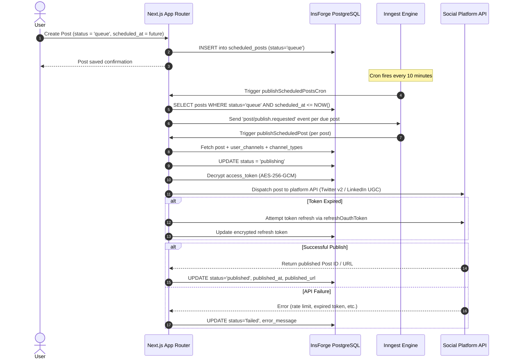

# Media Scheduler

An enterprise-grade social media management and content scheduling platform built with **Next.js 16 (App Router)**, **React 19**, **TypeScript**, **Tailwind CSS v4**, **shadcn/ui**, **Clerk Authentication**, **InsForge PostgreSQL BaaS**, and **Google Gemini AI**.

Media Scheduler empowers creators, social media managers, and marketing teams to brainstorm AI-driven ideas, draft and format posts, preview realistic cross-platform feeds across **8 social networks**, schedule automated background publishing via **Inngest cron jobs**, manage a media library, and track publishing analytics from a unified command center.

---

## Table of Contents

- [Key Features](#key-features)
- [Supported Social Channels](#supported-social-channels)
- [Design System & UI/UX](#design-system--uiux)
- [Tech Stack](#tech-stack)
- [Application Architecture & Routes](#application-architecture--routes)
- [API Endpoints Reference](#api-endpoints-reference)
- [Database Schema (InsForge PostgreSQL)](#database-schema-insforge-postgresql)
- [AI Integration](#ai-integration)
- [Background Publishing Workflow (Inngest)](#background-publishing-workflow-inngest)
- [Getting Started & Local Setup](#getting-started--local-setup)
- [Environment Variables](#environment-variables)
- [Docker & Container Deployment](#docker--container-deployment)
- [Security & Encryption](#security--encryption)
- [Available Scripts](#available-scripts)
- [License](#license)

---

## Key Features

### 1. Dashboard Command Center
- **KPI Metrics:** Track total posts in queue, scheduled content, published history, and draft reserves in real-time via `/api/post/totals`.
- **Personalized Header:** Time-of-day greeting, attention banner for pending drafts, and quick-action triggers for creating posts and generating ideas.
- **AI Content Studio Ribbon:** Instant AI generation prompt bar embedded directly in the dashboard overview.
- **Recent Activity Feed:** Live status chips (`Draft`, `Queue`, `Published`, `Failed`), scheduled dates, and channel icons.
- **Connected Channels Quick-Status:** Real-time visibility into active OAuth tokens across all 8 networks.

### 2. Post Composer & Multi-Channel Feed Previews
- **Single-Channel-Per-Post Model:** Each scheduled post targets one specific connected social channel with pixel-accurate platform previews.
- **Inline AI Writing Assistant:** Generate, rephrase, shorten, or expand post copy directly inside the composer using Google Gemini 2.5 Flash.
- **Dynamic Character Counter:** Real-time character counts using platform-specific `character_limit` values from the `channel_types` lookup table.
- **Scheduled Time Picker:** Native date/time scheduling with timezone preservation via `react-day-picker`.
- **Image Attachments:** Upload and attach images stored via InsForge Storage; both `url` and `key` are persisted in the post's `images` JSONB column.
- **Tri-Action Publishing Toolbar:** One-click shortcuts for **Save Draft**, **Queue for Publishing**, and immediate preview.
- **Pixel-Accurate Live Previews:** Tabbed realistic live previews for all 8 platforms:
  - **Twitter / X:** Compact tweet view with reply/repost/like counters and timestamp.
  - **LinkedIn:** Professional post card with company/author headline, connection degree, and engagement bar.
  - **Instagram:** Square feed card with header avatar, photo carousel placeholder, like/comment/share icons, and caption preview.
  - **TikTok:** Realistic 9:16 vertical smartphone viewport with creator handle, music sound ticker, right-side engagement rail (like, comment, bookmark, share), and bottom navigation overlay.
  - **Facebook:** Classic News Feed card with privacy badge (Public), timestamp, like/react buttons, and comment box.
  - **Threads:** Clean Meta Threads layout with avatar thread line, reply icons, and conversation simulation.
  - **Bluesky:** Decentralized AT Protocol layout with handle, domain handle, repost, and favorite actions.
  - **YouTube:** YouTube Community / Shorts caption preview with channel branding and subscriber badge.

### 3. Ideas Kanban Studio
- **AI Brainstorming Engine:** Generate 3 fresh post topics and captions based on business type and target audience via Google Gemini 2.5 Flash.
- **Drag-and-Drop Workflow:** Move idea cards seamlessly across Kanban groups powered by `@hello-pangea/dnd`:
  - `Unassigned` → `To Do` → `In Progress` → `Done`
- **Image Attachments on Ideas:** Attach reference images to idea cards stored in InsForge Storage.
- **Direct Conversion:** Single-click "Turn to Post" button instantly clones idea content into the Post Composer.

### 4. Interactive Publishing Calendar & List Views
- **Monthly, Weekly, & Day Calendar:** Full visual calendar powered by `react-big-calendar` with color-coded channel pills and status markers.
- **Custom Calendar Toolbar:** Segmented view switchers, quick navigation (Today, Prev, Next), and active date badges.
- **Content List View:** Chronological post list with status filter pills (`All`, `Draft`, `Queue`, `Published`, `Failed`), inline edit actions (via `edit-post-dialog`), and quick rescheduling.
- **URL-Synced Filters:** Status filters are synced to the URL query string via `nuqs` for shareable views.

### 5. Media Library
- **Grid & List Views:** Browse all uploaded images attached to posts with grid or list layout toggle.
- **Upload & Attach:** Upload images directly from the media library; assets are stored in InsForge Storage and linked to posts.
- **Search & Preview:** Search images by filename, preview full-size in a dialog, and attach to new posts directly from the library.

### 6. Analytics Dashboard
- **Publishing Velocity:** Track total published posts, estimated reach, and engagement rate derived from real post data.
- **Time-Range Selector:** Switch between 7-day, 30-day, and 90-day analytics windows.
- **Platform Breakdown:** Visualize published post distribution across all connected social channels.
- **Weekly Cadence Heatmap:** Identify optimal posting days and times with a day-of-week/hour activity grid.
- **Data-Driven Metrics:** All metrics computed from live `/api/post` and `/api/post/totals` responses — no mock data.

### 7. Channel Connections & OAuth Center
- **Connect & Disconnect:** Authenticate social accounts via official OAuth 2.0 with PKCE and encrypted `state` cookie protection.
- **Token Refresh:** Automatic OAuth token refresh via `refreshOauthToken` in the Inngest publish workflow.
- **Status Indicators:** Badge display of connection status, connected profile handle, and profile avatar fetched at connection time.
- **Credential Encryption:** All access and refresh tokens are AES-256-GCM encrypted before saving to `user_channels`.

### 8. Settings & Theme Engine
- **Dark Mode / Light Mode / System Theme:** Instant theme switching using `next-themes` with zero layout shift or flash.
- **Workspace Settings:** Profile customization, timezone selection, notification preferences, and connected account management.

### 9. Usage Quotas & Billing
- **Real-Time Usage Metering:** Visual progress meters tracking monthly post volume against plan limits.
- **Clerk Pricing Table Wrapper:** Native embedding of Clerk's `<PricingTable />` for billing management and upgrade flows.
- **Plan Comparison Matrix:** Transparent breakdown of Free, Creator, and Pro plan limits.

### 10. Full Marketing & Public Pages Suite
- **Modern Landing Page:** Hero section with animated badges, interactive feature showcases, channel pill carousel, and customer testimonials.
- **Dedicated Feature Walkthrough:** Deep-dive into AI generation, multi-channel scheduling, and analytics.
- **Dynamic Pricing Page:** Monthly vs. annual billing toggle with an interactive FAQ accordion.
- **Channels Directory:** Dedicated page explaining connection capabilities for each supported social network.
- **Workflow & Contact Pages:** Visual diagrams explaining end-to-end publishing, plus a contact inquiry form.
- **Legal Compliance:** Comprehensive Privacy Policy and Terms of Service documents.

---

## Supported Social Channels

| Platform | Channel Key | OAuth Flow | Character Limit | Live Preview | Publishing |
| :--- | :--- | :--- | :---: | :---: | :---: |
| **Twitter / X** | `TWITTER` | OAuth 2.0 PKCE | 280 | ✅ | ✅ Active |
| **LinkedIn** | `LINKEDIN` | OAuth 2.0 (`w_member_social`) | 3,000 | ✅ | ✅ Active |
| **Instagram** | `INSTAGRAM` | Meta Graph API | 2,200 | ✅ | 🔧 Ready |
| **Threads** | `THREADS` | Meta Threads API | 500 | ✅ | 🔧 Ready |
| **Facebook** | `FACEBOOK` | Meta Graph API | 63,206 | ✅ | 🔧 Ready |
| **Bluesky** | `BLUESKY` | AT Protocol OAuth | 300 | ✅ | 🔧 Ready |
| **YouTube** | `YOUTUBE` | Google OAuth 2.0 | 100 | ✅ | 🔧 Ready |
| **TikTok** | `TIKTOK` | TikTok Creator API v2 | 100 | ✅ | 🔧 Ready |

> **Publishing Note:** Twitter/X and LinkedIn have end-to-end background publishing via the Inngest cron runner. All 8 platforms support live feed simulation, OAuth connection flows, encrypted token storage, and database association. Character limits are seeded in the `channel_types` table and enforced in the composer.

---

## Design System & UI/UX

Media Scheduler includes a persisted Master Design System located in [`design-system/media-scheduler/`](file:///c:/Users/sugud/OneDrive/Documents/media-scheduler/design-system/).

### Design Tokens & Philosophy
- **Aesthetic:** Editorial, modern SaaS interface built with high-density layouts, subtle micro-borders, and refined typography.
- **Color Palette:**
  - **Neutral Base:** Slate & Zinc (`hsl(222, 47%, 11%)` dark base; clean neutral light base)
  - **Brand Accent:** Indigo & Violet (`hsl(238, 84%, 60%)` / `hsl(262, 83%, 58%)`)
  - **Semantic States:** Emerald (`Published`), Amber (`Queue`/Scheduled), Slate (`Draft`), Rose (`Failed`)
  - **Platform Brand Accents:** Twitter (#000000 / #1DA1F2), LinkedIn (#2867B2), Instagram (#E4405F), TikTok (#000000), Facebook (#1877F2), Threads (#000000), Bluesky (#1285FE), YouTube (#FF0000)
- **Typography:** Inter / system UI font stack with high-legibility tabular figures for counters and timestamps.
- **Component Library:** `shadcn/ui` built on Radix UI primitives with `class-variance-authority`.
- **Animations:** `framer-motion` for page transitions and micro-interactions; `tw-animate-css` for CSS-level animations.
- **Icons:** `lucide-react` (v1.20) and `@hugeicons/react` (v1.1.7) for comprehensive icon coverage.
- **Elevation:** Layered translucent card surfaces with subtle borders (`border-border/50` or `border-border/70`) and delicate drop shadows.
- **Zero Layout Shift:** Responsive layouts tested on mobile (375px), tablet (768px), desktop (1280px), and ultrawide monitors.

---

## Tech Stack

| Category | Technology | Version |
| :--- | :--- | :--- |
| **Framework** | [Next.js](https://nextjs.org/) (App Router, standalone output) | 16.2.9 |
| **Language** | [TypeScript](https://www.typescriptlang.org/) | ^5 |
| **UI Library** | [React](https://react.dev/) | 19.2.4 |
| **Styling** | [Tailwind CSS v4](https://tailwindcss.com/) | ^4 |
| **Components** | [shadcn/ui](https://ui.shadcn.com/) + [Radix UI](https://www.radix-ui.com/) | shadcn ^4.11 / radix-ui ^1.6 |
| **Base UI** | [@base-ui/react](https://base-ui.com/) | ^1.5.0 |
| **Animations** | [Framer Motion](https://www.framer.com/motion/) | ^12.40 |
| **Theme Support** | [next-themes](https://github.com/pacocoursey/next-themes) | ^0.4.6 |
| **Authentication** | [Clerk Auth](https://clerk.com/) (`@clerk/nextjs`) | ^7.5.3 |
| **Database & BaaS** | [InsForge](https://insforge.dev) (`@insforge/sdk`) | ^1.4.2 |
| **AI Engine** | Google Gemini 2.5 Flash (via Gemini API + InsForge AI gateway fallback) | gemini-2.5-flash |
| **Background Jobs** | [Inngest](https://www.inngest.com/) (cron-based publish scheduler) | ^4.6.0 |
| **State & Data Fetching** | [TanStack Query v5](https://tanstack.com/query) | ^5.101.0 |
| **URL State** | [nuqs](https://nuqs.47ng.com/) | ^2.8.9 |
| **Calendar Engine** | [react-big-calendar](https://github.com/jquense/react-big-calendar) + `date-fns` | ^1.20 / ^4.4 |
| **Drag & Drop** | [@hello-pangea/dnd](https://github.com/hello-pangea/dnd) | ^18.0.1 |
| **Carousel** | [embla-carousel-react](https://www.embla-carousel.com/) | ^8.6.0 |
| **Date Picker** | [react-day-picker](https://react-day-picker.js.org/) | ^10.0.1 |
| **Command Palette** | [cmdk](https://cmdk.paco.me/) | ^1.1.1 |
| **Emoji Picker** | [@ferrucc-io/emoji-picker](https://github.com/ferrucc-io/emoji-picker) | ^0.1.1 |
| **Toast Notifications** | [sonner](https://sonner.emilkowal.ski/) | ^2.0.7 |
| **Icons** | [lucide-react](https://lucide.dev/) + [@hugeicons/react](https://hugeicons.com/) | ^1.20 / ^1.1.7 |
| **Cryptography** | Node.js native `crypto` (AES-256-GCM ciphering) | Built-in |

---

## Application Architecture & Routes

```
media-scheduler/
├── app/
│   ├── (auth)/                         # Clerk authentication wrappers
│   ├── (dashboard)/                    # Authenticated app shell (dashboard layout)
│   │   ├── analytics/                  # Analytics & publishing velocity dashboard
│   │   ├── billing/                    # Usage quotas & Clerk PricingTable
│   │   ├── content/                    # Post list view with status filters
│   │   ├── dashboard/                  # Main KPI dashboard command center
│   │   ├── ideas/                      # Ideas Kanban board + AI brainstorm
│   │   ├── media/                      # Media library (images, uploads)
│   │   ├── schedule/                   # Post composer + calendar views
│   │   └── settings/                   # Profile, theme & workspace preferences
│   ├── (marketing)/                    # Public marketing pages
│   │   ├── channels/                   # Social channel capabilities page
│   │   ├── contact/                    # Contact inquiry form
│   │   ├── features/                   # Comprehensive product features
│   │   ├── pricing/                    # Plans, billing toggle & FAQ
│   │   ├── privacy/                    # Privacy policy
│   │   ├── terms/                      # Terms of service
│   │   └── workflow/                   # Visual multi-channel scheduling guide
│   ├── api/                            # Next.js Route Handlers
│   │   ├── channel/                    # Channel connect / callback / disconnect
│   │   ├── health/                     # Health check endpoint
│   │   ├── idea/                       # Idea CRUD + AI generation
│   │   ├── inngest/                    # Inngest event intake webhook
│   │   ├── post/                       # Post CRUD + generate-post + totals
│   │   └── upload-image/               # Image upload to InsForge Storage
│   ├── routes/                         # Shared route page implementations
│   │   ├── dashboard/                  # Dashboard, schedule, ideas, billing, settings
│   │   ├── landing/                    # Landing page sections
│   │   ├── sign-in/                    # Clerk sign-in page
│   │   └── sign-up/                    # Clerk sign-up page
│   ├── layout.tsx                      # Root layout (Clerk + ThemeProvider + QueryProvider)
│   └── page.tsx                        # Public landing page
├── components/
│   ├── channel-avatar.tsx              # Platform-branded avatar with color ring
│   ├── content-textarea.tsx            # AI-powered textarea with actions toolbar
│   ├── dark-mode-toggle.tsx            # Light/Dark/System theme switcher
│   ├── dashboard-header.tsx            # Dashboard sticky top bar
│   ├── logo.tsx                        # Brand logo component
│   ├── query-provider.tsx              # TanStack Query provider wrapper
│   ├── theme-provider.tsx              # next-themes provider
│   ├── idea/                           # Idea card, Kanban column, AI panel
│   ├── schedule/                       # Post composer, calendar, list, AI assistant
│   │   ├── ai-assistant.tsx            # Inline AI writing panel
│   │   ├── calendar-view.tsx           # react-big-calendar integration
│   │   ├── create-post-dialog.tsx      # Full post composer dialog (8 platform previews)
│   │   ├── edit-post-dialog.tsx        # Edit scheduled/draft post dialog
│   │   ├── list-view.tsx               # Filterable chronological post list
│   │   ├── schedule-date-picker.tsx    # Date/time scheduler with react-day-picker
│   │   ├── schedule-toolbar.tsx        # Save/Queue/Draft action toolbar
│   │   └── preview/                    # 8 platform-specific live preview components
│   │       ├── bluesky-preview.tsx
│   │       ├── facebook-preview.tsx
│   │       ├── instagram-preview.tsx
│   │       ├── linkedin-preview.tsx
│   │       ├── thread-preview.tsx
│   │       ├── tiktok-preview.tsx
│   │       ├── twitter-preview.tsx
│   │       └── youtube-preview.tsx
│   ├── settings/                       # Settings form components
│   └── ui/                             # shadcn/ui primitives (button, card, dialog, etc.)
├── lib/
│   ├── ai.ts                           # Google Gemini API client + InsForge AI fallback
│   ├── encryption.ts                   # AES-256-GCM encrypt/decrypt for OAuth tokens
│   ├── insforge-server.ts              # InsForge server & admin clients (Clerk JWT)
│   ├── utils.ts                        # Tailwind merge utility
│   ├── db/                             # SQL migration files & schema diagram
│   │   ├── create-social-scheduling-tables.sql
│   │   ├── fix-channel-types-rls.sql
│   │   └── schema-diagram.md
│   └── social-oauth/                   # OAuth helpers (PKCE, state cookie, token exchange)
│       ├── index.ts                    # refreshOauthToken + exchange helpers
│       ├── pkce.ts                     # PKCE code verifier/challenge generation
│       ├── state.ts                    # Encrypted state cookie management
│       └── types.ts                    # OAuth provider configuration types
├── inngest/
│   ├── client.ts                       # Inngest client initialization
│   └── functions/
│       └── publish-scheduled-posts.ts  # Cron + event-driven publish pipeline
├── constants/
│   └── channels.ts                     # ChannelTypeEnum & platform metadata
├── hooks/
│   └── use-mobile.ts                   # Responsive mobile breakpoint hook
├── types/
│   ├── channel.type.ts                 # ChannelType TypeScript type
│   ├── idea.type.ts                    # IdeaType TypeScript type
│   └── post.type.ts                    # PostType & CalendarPostType TypeScript types
├── design-system/                      # Persisted design system specifications
├── public/                             # Static assets
├── Dockerfile                          # Multi-stage production Docker build
├── docker-compose.yml                  # Docker Compose configuration
└── next.config.ts                      # Next.js config (standalone output, image domains)
```

### Full Route Map

| Route Path | Access | Description |
| :--- | :--- | :--- |
| `/` | Public | Landing page with features, social proof, and CTA |
| `/features` | Public | Comprehensive product features and capabilities |
| `/pricing` | Public | Plans, annual/monthly toggle, features table, FAQs |
| `/workflow` | Public | Visual explanation of the multi-channel scheduling workflow |
| `/channels` | Public | Information on all 8 supported social channels |
| `/contact` | Public | User support & inquiry contact form |
| `/privacy` | Public | Privacy policy and data handling documentation |
| `/terms` | Public | Terms of service and acceptable use agreement |
| `/routes/sign-in` | Public | Clerk authentication login portal |
| `/routes/sign-up` | Public | Clerk authentication registration portal |
| `/dashboard` | Protected | Dashboard KPI overview, metrics, recent posts |
| `/ideas` | Protected | Drag-and-drop Kanban idea board with AI brainstorm |
| `/schedule` | Protected | Post composer with 8-channel previews & calendar |
| `/content` | Protected | Filterable list view of all posts by status |
| `/media` | Protected | Media library — browse, upload, and manage images |
| `/analytics` | Protected | Publishing velocity, reach estimates, cadence heatmap |
| `/billing` | Protected | Usage counters, plan tiers, and Clerk `<PricingTable />` |
| `/settings` | Protected | Appearance, theme, timezone, and workspace preferences |

---

## API Endpoints Reference

### Posts (`/api/post`)
- `GET /api/post` — Fetch user's scheduled posts (supports `status` filter: `queue`, `draft`, `published`, `failed`; supports `channel_id` filter).
- `POST /api/post` — Create a new scheduled post. Accepts `content`, `images`, `user_channel_id`, `scheduled_at`, `status` (`draft` | `queue`).
- `GET /api/post/[id]` — Retrieve a specific post with joined `user_channels` and `channel_types` data.
- `PATCH /api/post/[id]` — Update post content, images, scheduled time, or status.
- `DELETE /api/post/[id]` — Delete a scheduled post.
- `GET /api/post/totals` — Return aggregate counts: `totalQueue`, `totalPublished`, `totalFailed`, `totalDrafts`.
- `POST /api/post/generate-post` — AI content generation endpoint using Gemini 2.5 Flash (supports `generate`, `rephrase`, `shorten`, `expand` actions).

### Ideas (`/api/idea`)
- `GET /api/idea` — Fetch all ideas for the authenticated user, grouped by `idea_groups`.
- `POST /api/idea` — Create a new idea card with title, description, group, images, and sort order.
- `PATCH /api/idea/[id]` — Update idea title, description, group (Kanban column), images, or sort order.
- `DELETE /api/idea/[id]` — Delete an idea card.
- `POST /api/idea/generate` — Generate 3 AI idea suggestions via Gemini 2.5 Flash.

### Social Channels & OAuth (`/api/channel`)
- `GET /api/channel` — List all connected social channels (`user_channels`) for the authenticated user, with joined `channel_types`.
- `GET /api/channel/connect` — Generate OAuth authorization URL with PKCE challenge and encrypted state cookie.
- `GET /api/channel/callback` — Exchange OAuth authorization code for access/refresh tokens; encrypt and persist to `user_channels`.
- `DELETE /api/channel/disconnect` — Revoke and remove a connected social channel.

### Other Endpoints
- `GET /api/health` — Health check endpoint returning `{ status: "ok" }`.
- `POST /api/inngest` — Inngest event intake webhook (receives and routes background job events).
- `POST /api/upload-image` — Upload an image to InsForge Storage; returns `{ url, key }` for persistence.

---

## Database Schema (InsForge PostgreSQL)

Media Scheduler uses [InsForge](https://insforge.dev) as its PostgreSQL backend. Row Level Security (RLS) is enforced on all user tables via a `requesting_user_id()` function that reads the Clerk JWT `sub` claim.

### Schema Overview

```
auth.users (Clerk-managed via InsForge JWT)
    │
    ├── channel_types        (seed table — platform metadata, character limits)
    │       │
    │       └── user_channels (one row per connected OAuth account)
    │               │
    │               └── scheduled_posts (one row per scheduled/drafted post)
    │
    ├── idea_groups          (seed table — Kanban column names)
    │       │
    │       └── ideas         (user idea cards)
    │
    └── subscriptions        (billing plan records)
```

### 1. `channel_types` Table *(Seeded lookup)*
| Column | Type | Description |
| :--- | :--- | :--- |
| `id` | `UUID` | Primary Key |
| `type` | `TEXT UNIQUE` | Platform key: `TWITTER`, `LINKEDIN`, `INSTAGRAM`, `THREADS`, `FACEBOOK`, `BLUESKY`, `YOUTUBE`, `TIKTOK` |
| `name` | `TEXT` | Human-readable platform name |
| `color` | `TEXT` | Platform brand hex color |
| `character_limit` | `INTEGER` | Platform-enforced max character count |
| `created_at` | `TIMESTAMPTZ` | Seed timestamp |

### 2. `user_channels` Table *(RLS-protected)*
| Column | Type | Constraints | Description |
| :--- | :--- | :--- | :--- |
| `id` | `UUID` | Primary Key | Unique channel record ID |
| `user_id` | `TEXT` | Not Null, Indexed | Clerk User ID (JWT `sub`) |
| `channel_type_id` | `UUID` | FK → `channel_types.id` | Platform reference |
| `provider_account_id` | `TEXT` | Nullable | Platform-specific user ID |
| `handle` | `TEXT` | Nullable | Platform username or display name |
| `profile_image` | `TEXT` | Nullable | Profile picture URL |
| `profile_url` | `TEXT` | Nullable | Public profile URL |
| `access_token` | `TEXT` | Nullable | AES-256-GCM encrypted access token |
| `refresh_token` | `TEXT` | Nullable | AES-256-GCM encrypted refresh token |
| `token_expires_at` | `TIMESTAMPTZ` | Nullable | Token expiration timestamp |
| `is_connected` | `BOOLEAN` | Default `false` | Connection active flag |
| `is_active` | `BOOLEAN` | Default `true` | Soft-delete flag |
| `created_at` | `TIMESTAMPTZ` | Default `NOW()` | Connection timestamp |
| `updated_at` | `TIMESTAMPTZ` | Default `NOW()` | Last update timestamp |

> **Unique constraint:** `(user_id, channel_type_id)` — one connection per platform per user.

### 3. `scheduled_posts` Table *(RLS-protected)*
| Column | Type | Constraints | Description |
| :--- | :--- | :--- | :--- |
| `id` | `UUID` | Primary Key | Unique post identifier |
| `user_id` | `TEXT` | Not Null, Indexed | Clerk User ID |
| `user_channel_id` | `UUID` | FK → `user_channels.id` CASCADE | Target connected channel |
| `content` | `TEXT` | Not Null | Post caption or body text |
| `images` | `JSONB` | Default `'[]'` | Array of `{ url, key }` image objects |
| `scheduled_at` | `TIMESTAMPTZ` | Not Null | Intended publishing timestamp |
| `status` | `TEXT` | Check: `queue`, `draft`, `published`, `failed` | Post lifecycle status |
| `published_at` | `TIMESTAMPTZ` | Nullable | Actual publish timestamp |
| `published_url` | `TEXT` | Nullable | URL of the published post |
| `error_message` | `TEXT` | Nullable | Failure reason if publishing failed |
| `created_at` | `TIMESTAMPTZ` | Default `NOW()` | Creation timestamp |
| `updated_at` | `TIMESTAMPTZ` | Default `NOW()` | Last modification timestamp |

### 4. `idea_groups` Table *(Seeded lookup)*
| Column | Type | Description |
| :--- | :--- | :--- |
| `id` | `UUID` | Primary Key |
| `name` | `TEXT UNIQUE` | Group name: `Unassigned`, `To Do`, `In Progress`, `Done` |
| `created_at` | `TIMESTAMPTZ` | Seed timestamp |

### 5. `ideas` Table *(RLS-protected)*
| Column | Type | Constraints | Description |
| :--- | :--- | :--- | :--- |
| `id` | `UUID` | Primary Key | Unique idea identifier |
| `user_id` | `TEXT` | Not Null, Indexed | Clerk User ID |
| `group_id` | `UUID` | FK → `idea_groups.id` | Kanban column assignment |
| `title` | `TEXT` | Not Null | Idea headline or title |
| `description` | `TEXT` | Nullable | Detailed draft notes or caption |
| `images` | `JSONB` | Default `'[]'` | Array of `{ url, key }` image objects |
| `sort_order` | `INTEGER` | Default `0` | Position within Kanban column |
| `created_at` | `TIMESTAMPTZ` | Default `NOW()` | Creation timestamp |
| `updated_at` | `TIMESTAMPTZ` | Default `NOW()` | Last modification timestamp |

### Initializing the Schema

Run the migration SQL file against your InsForge PostgreSQL instance:

```bash
# Via InsForge CLI
insforge db execute --file lib/db/create-social-scheduling-tables.sql

# Or paste directly in the InsForge SQL Editor at:
# https://your-project.us-east.insforge.app
```

---

## AI Integration

Media Scheduler uses **Google Gemini 2.5 Flash** as its primary AI engine, with automatic fallback to the **InsForge AI Gateway** when no direct API key is configured.

### AI Features

| Feature | Endpoint | Description |
| :--- | :--- | :--- |
| **Post Generation** | `POST /api/post/generate-post` | Generate, rephrase, shorten, or expand post copy |
| **Idea Brainstorming** | `POST /api/idea/generate` | Generate 3 content ideas from business type + audience |
| **Inline Composer AI** | Client-side via `/api/post/generate-post` | Live AI assistance inside the post dialog |

### Actions Supported (`ActionType`)
- `generate` — Write a fresh post based on a freeform prompt
- `rephrase` — Rewrite existing content with same meaning
- `shorten` — Condense content while preserving key message
- `expand` — Add helpful detail while maintaining tone

### Model Configuration

```bash
# Primary: Direct Google Gemini API (recommended)
GEMINI_API_KEY=<your_gemini_api_key>

# Optional model override (defaults to gemini-2.5-flash)
GEMINI_MODEL=gemini-2.5-flash

# Fallback: InsForge AI Gateway (no key needed if InsForge is configured)
# Uses: google/gemini-2.5-flash via InsForge
```

---

## Background Publishing Workflow (Inngest)

Media Scheduler delegates scheduled execution to [Inngest](https://www.inngest.com/), ensuring reliable publishing without long-running server processes. The system uses a **cron-based polling + event fan-out** architecture.



### Inngest Functions

| Function ID | Trigger | Description |
| :--- | :--- | :--- |
| `publish-scheduled-posts-cron` | Cron: `*/10 * * * *` | Polls `scheduled_posts` for due items and fans out `post/publish.requested` events |
| `publish-scheduled-post` | Event: `post/publish.requested` | Loads post, decrypts tokens, refreshes if expired, dispatches to social API, records result |

---

## Getting Started & Local Setup

### Prerequisites
- **Node.js**: v18.18+ or v20+ recommended
- **Package Manager**: `npm` (or `pnpm` / `yarn`)
- **Accounts Needed**:
  - [Clerk](https://clerk.com/) — authentication
  - [InsForge](https://insforge.dev) — PostgreSQL database & storage
  - [Inngest](https://www.inngest.com/docs/local-development) — background job runner
  - [Google AI Studio](https://aistudio.google.com/) — Gemini API key (optional, InsForge AI fallback available)
  - Developer accounts for Twitter/X, LinkedIn, Meta, etc. (optional for local OAuth testing)

### Installation

1. **Clone the repository:**
   ```bash
   git clone https://github.com/your-username/media-scheduler.git
   cd media-scheduler
   ```

2. **Install dependencies:**
   ```bash
   npm install
   ```

3. **Configure Environment Variables:**
   ```bash
   cp .env.example .env
   ```
   Fill in your Clerk, InsForge, Inngest, Gemini, and OAuth credentials (see [Environment Variables](#environment-variables)).

4. **Configure Clerk JWT Template:**
   In your [Clerk Dashboard](https://dashboard.clerk.com) → JWT Templates, create a template named `insforge` pointing to your InsForge project. Set `NEXT_PUBLIC_CLERK_INSFORGE_TEMPLATE=insforge` in your `.env`.

5. **Initialize Database Tables:**
   ```bash
   # Run the migration SQL in your InsForge project SQL editor
   # File: lib/db/create-social-scheduling-tables.sql
   ```

6. **Start the Next.js Development Server:**
   ```bash
   npm run dev
   ```
   The application runs at [http://localhost:3000](http://localhost:3000).

7. **Start the Inngest Dev Server (separate terminal):**
   ```bash
   npx inngest-cli@latest dev
   ```
   The Inngest dashboard will be available at [http://localhost:8288](http://localhost:8288) to monitor cron jobs and events.

---

## Environment Variables

Create a `.env` file in the root directory (copy from `.env.example`):

```bash
# ── InsForge BaaS (PostgreSQL + Storage + AI) ────────────────
NEXT_PUBLIC_INSFORGE_BASE_URL=https://<your-project-id>.us-east.insforge.app
NEXT_PUBLIC_INSFORGE_ANON_KEY=ik_<your_anon_key>
INSFORGE_ANON_KEY=<your_insforge_jwt>

# ── Clerk Authentication ──────────────────────────────────────
NEXT_PUBLIC_CLERK_PUBLISHABLE_KEY=pk_test_<your_publishable_key>
CLERK_SECRET_KEY=sk_test_<your_secret_key>
NEXT_PUBLIC_CLERK_INSFORGE_TEMPLATE=insforge
CLERK_INSFORGE_TEMPLATE=insforge

# Clerk route config
NEXT_PUBLIC_CLERK_SIGN_IN_URL=/routes/sign-in
NEXT_PUBLIC_CLERK_SIGN_UP_URL=/routes/sign-up
NEXT_PUBLIC_CLERK_SIGN_IN_FALLBACK_REDIRECT_URL=/
NEXT_PUBLIC_CLERK_SIGN_UP_FALLBACK_REDIRECT_URL=/

# ── App ───────────────────────────────────────────────────────
NEXT_PUBLIC_APP_URL=http://localhost:3000

# ── AI (Google Gemini 2.5 Flash) ─────────────────────────────
# Get from: https://aistudio.google.com/
GEMINI_API_KEY=<your_gemini_api_key>
# Optional: override model (default: gemini-2.5-flash)
# GEMINI_MODEL=gemini-2.5-flash

# ── Inngest Background Jobs ───────────────────────────────────
INNGEST_EVENT_KEY=<your_inngest_event_key>
INNGEST_SIGNING_KEY=<your_inngest_signing_key>

# ── Security Keys ─────────────────────────────────────────────
# Generate: node -e "console.log(require('crypto').randomBytes(32).toString('hex'))"
CHANNEL_TOKEN_ENCRYPTION_KEY=<32_byte_hex>
CHANNEL_OAUTH_STATE_SECRET=<32_byte_hex>

# ── Twitter / X OAuth ─────────────────────────────────────────
TWITTER_CLIENT_ID=
TWITTER_CLIENT_SECRET=
TWITTER_AUTH_URL=https://x.com/i/oauth2/authorize
TWITTER_TOKEN_URL=https://api.x.com/2/oauth2/token
TWITTER_PROFILE_URL=https://api.x.com/2/users/me?user.fields=profile_image_url,username
TWITTER_SCOPES=tweet.read,users.read,tweet.write,offline.access,media.write

# ── Instagram ─────────────────────────────────────────────────
INSTAGRAM_CLIENT_ID=
INSTAGRAM_CLIENT_SECRET=
INSTAGRAM_AUTH_URL=https://api.instagram.com/oauth/authorize
INSTAGRAM_TOKEN_URL=https://api.instagram.com/oauth/access_token
INSTAGRAM_PROFILE_URL=https://graph.instagram.com/me?fields=id,username,profile_picture_url
INSTAGRAM_SCOPES=instagram_basic,instagram_content_publish,pages_read_engagement

# ── Threads ───────────────────────────────────────────────────
THREADS_CLIENT_ID=
THREADS_CLIENT_SECRET=
THREADS_AUTH_URL=https://threads.net/oauth/authorize
THREADS_TOKEN_URL=https://graph.threads.net/oauth/access_token
THREADS_PROFILE_URL=https://graph.threads.net/me?fields=id,username,threads_profile_picture_url
THREADS_SCOPES=threads_basic,threads_content_publish

# ── Facebook ──────────────────────────────────────────────────
FACEBOOK_CLIENT_ID=
FACEBOOK_CLIENT_SECRET=
FACEBOOK_AUTH_URL=https://www.facebook.com/v19.0/dialog/oauth
FACEBOOK_TOKEN_URL=https://graph.facebook.com/v19.0/oauth/access_token
FACEBOOK_PROFILE_URL=https://graph.facebook.com/me?fields=id,name,picture
FACEBOOK_SCOPES=pages_show_list,pages_read_engagement,pages_manage_posts

# ── LinkedIn ──────────────────────────────────────────────────
LINKEDIN_CLIENT_ID=
LINKEDIN_CLIENT_SECRET=
LINKEDIN_AUTH_URL=https://www.linkedin.com/oauth/v2/authorization
LINKEDIN_TOKEN_URL=https://www.linkedin.com/oauth/v2/accessToken
LINKEDIN_PROFILE_URL=https://api.linkedin.com/v2/userinfo
LINKEDIN_SCOPES=openid,profile,email,w_member_social

# ── Bluesky ───────────────────────────────────────────────────
BLUESKY_CLIENT_ID=
BLUESKY_CLIENT_SECRET=
BLUESKY_AUTH_URL=https://bsky.social/oauth/authorize
BLUESKY_TOKEN_URL=https://bsky.social/oauth/token
BLUESKY_PROFILE_URL=https://bsky.social/xrpc/app.bsky.actor.getProfile
BLUESKY_SCOPES=atproto,transition:generic

# ── YouTube ───────────────────────────────────────────────────
YOUTUBE_CLIENT_ID=
YOUTUBE_CLIENT_SECRET=
YOUTUBE_AUTH_URL=https://accounts.google.com/o/oauth2/v2/auth
YOUTUBE_TOKEN_URL=https://oauth2.googleapis.com/token
YOUTUBE_PROFILE_URL=https://www.googleapis.com/youtube/v3/channels?part=snippet&mine=true
YOUTUBE_SCOPES=https://www.googleapis.com/auth/youtube.upload,https://www.googleapis.com/auth/youtube.readonly

# ── TikTok ────────────────────────────────────────────────────
TIKTOK_CLIENT_ID=
TIKTOK_CLIENT_SECRET=
TIKTOK_AUTH_URL=https://www.tiktok.com/v2/auth/authorize
TIKTOK_TOKEN_URL=https://open.tiktokapis.com/v2/oauth/token
TIKTOK_PROFILE_URL=https://open.tiktokapis.com/v2/user/info/?fields=open_id,avatar_url,display_name,username
TIKTOK_SCOPES=user.info.basic,video.publish,video.upload
```

---

## Docker & Container Deployment

Media Scheduler includes a production-optimized multi-stage `Dockerfile` with `standalone` Next.js output and a `docker-compose.yml` for local container orchestration.

### Run with Docker Compose

```bash
# Build and run containers in detached mode
docker compose up -d --build

# View container logs
docker compose logs -f

# Stop containers
docker compose down
```

### Build & Run Docker Image Manually

```bash
# Using npm scripts
npm run docker:build
npm run docker:run

# Or manually
docker build -t media-scheduler:latest .
docker run -p 3000:3000 --env-file .env media-scheduler:latest
```

> **Note:** The `Dockerfile` uses multi-stage builds (`deps` → `builder` → `runner`) with `output: "standalone"` in `next.config.ts` for minimal image size.

---

## Security & Encryption

- **Token Ciphering:** OAuth access and refresh tokens are **never stored as plaintext**. They are encrypted using `AES-256-GCM` with a unique random IV and authentication tag per record, using the `CHANNEL_TOKEN_ENCRYPTION_KEY` environment variable. Decryption only happens server-side inside Inngest functions.
- **OAuth CSRF Protection:** All OAuth flows generate a random cryptographic `state` parameter, signed and stored in a secure `HttpOnly`, `SameSite=Lax` cookie using `CHANNEL_OAUTH_STATE_SECRET`. PKCE (`code_verifier` / `code_challenge`) is applied where supported (Twitter/X).
- **Row Level Security (RLS):** All InsForge database tables (`user_channels`, `scheduled_posts`, `ideas`) enforce RLS policies using `requesting_user_id()`, which reads the Clerk JWT `sub` claim from the request context.
- **Authentication Guards:** All API route handlers verify Clerk session tokens via `auth()` before any database operation. Unauthenticated requests receive `401 Unauthorized`.
- **Environment Isolation:** Sensitive keys (`CLERK_SECRET_KEY`, `INSFORGE_ANON_KEY`, `CHANNEL_TOKEN_ENCRYPTION_KEY`, `GEMINI_API_KEY`) are kept server-side only and are never exposed to the client bundle.
- **Image CDN Allowlist:** `next.config.ts` restricts `next/image` to trusted domains: `img.clerk.com`, `*.insforge.app`, `pbs.twimg.com`, `media.licdn.com`.

---

## Available Scripts

```bash
# Start Next.js development server (with Turbopack)
npm run dev

# Build production bundle
npm run build

# Start production server
npm run start

# Run ESLint code quality checks
npm run lint

# Docker shortcuts
npm run docker:build   # Build Docker image tagged 'media-scheduler'
npm run docker:run     # Run container on port 3000 with .env
npm run docker:up      # docker compose up -d
npm run docker:down    # docker compose down
```

---

## License

This project is licensed under the [MIT License](LICENSE).

```text
MIT License

Copyright (c) 2026 Suguda Thakur Marndi

Permission is hereby granted, free of charge, to any person obtaining a copy
of this software and associated documentation files (the "Software"), to deal
in the Software without restriction, including without limitation the rights
to use, copy, modify, merge, publish, distribute, sublicense, and/or sell
copies of the Software, and to permit persons to whom the Software is
furnished to do so, subject to the following conditions:

The above copyright notice and this permission notice shall be included in all
copies or substantial portions of the Software.

THE SOFTWARE IS PROVIDED "AS IS", WITHOUT WARRANTY OF ANY KIND, EXPRESS OR
IMPLIED, INCLUDING BUT NOT LIMITED TO THE WARRANTIES OF MERCHANTABILITY,
FITNESS FOR A PARTICULAR PURPOSE AND NONINFRINGEMENT. IN NO EVENT SHALL THE
AUTHORS OR COPYRIGHT HOLDERS BE LIABLE FOR ANY CLAIM, DAMAGES OR OTHER
LIABILITY, WHETHER IN AN ACTION OF CONTRACT, TORT OR OTHERWISE, ARISING FROM,
OUT OF OR IN CONNECTION WITH THE SOFTWARE OR THE USE OR OTHER DEALINGS IN THE
SOFTWARE.
```
