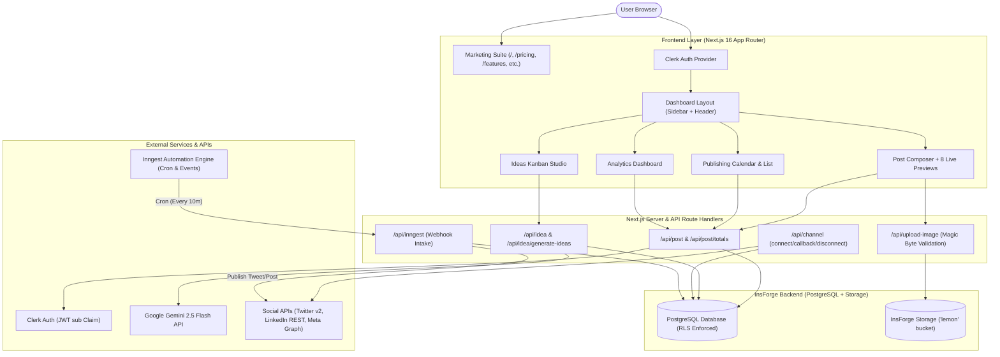
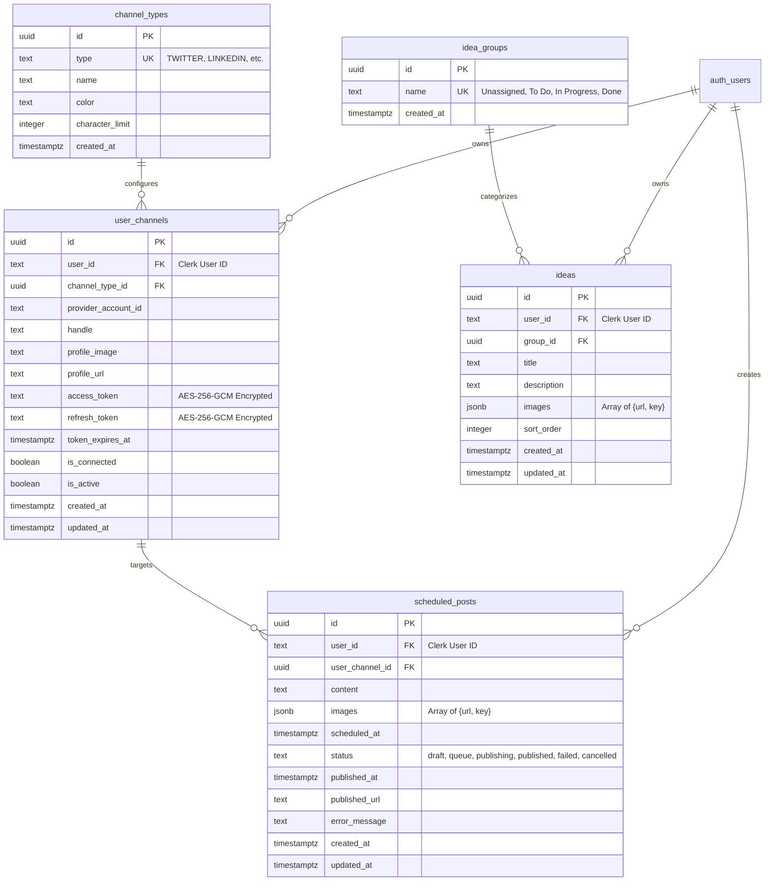
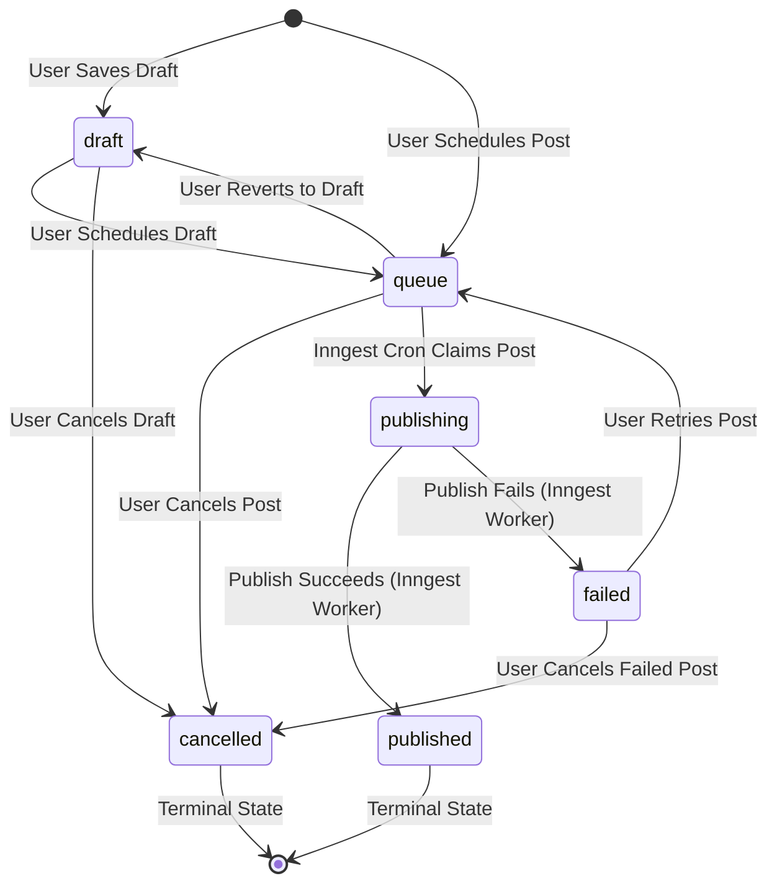
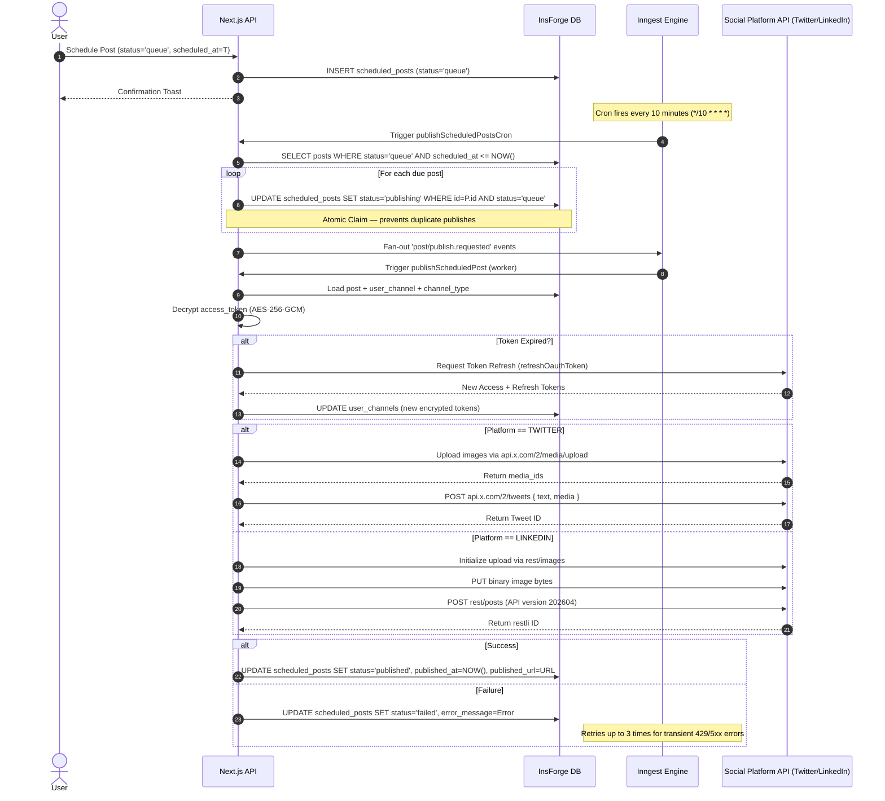

# Media Scheduler

[](https://nextjs.org/)
[](https://react.dev/)
[](https://www.typescriptlang.org/)
[](https://tailwindcss.com/)
[](https://ui.shadcn.com/)
[](https://clerk.com/)
[](https://insforge.dev)
[](https://www.inngest.com/)
[](https://aistudio.google.com/)
[](https://www.docker.com/)
[](LICENSE)

An enterprise-grade, multi-channel social media management and content automation platform built with **Next.js 16 (App Router)**, **React 19**, **TypeScript**, **Tailwind CSS v4**, **shadcn/ui**, **Clerk Authentication**, **InsForge PostgreSQL BaaS**, and **Google Gemini AI**.

Media Scheduler empowers creators, marketing teams, and digital agencies to brainstorm AI-driven ideas, draft and format copy, preview realistic platform feeds across **8 social networks**, schedule automated background publishing via **Inngest cron workflows**, curate a media library, and track publishing analytics from a single unified command center.

---

## Table of Contents

- [Executive Overview](#executive-overview)
- [Key Features](#key-features)
  - [1. Dashboard Command Center](#1-dashboard-command-center)
  - [2. Post Composer & Live Multi-Channel Previews](#2-post-composer--live-multi-channel-previews)
  - [3. Ideas Kanban Studio & AI Brainstorming](#3-ideas-kanban-studio--ai-brainstorming)
  - [4. Interactive Publishing Calendar & Content List](#4-interactive-publishing-calendar--content-list)
  - [5. Media Asset Library](#5-media-asset-library)
  - [6. Analytics & Publishing Velocity Dashboard](#6-analytics--publishing-velocity-dashboard)
  - [7. Social Channel Connections & OAuth Center](#7-social-channel-connections--oauth-center)
  - [8. Usage Quotas & Plan Billing](#8-usage-quotas--plan-billing)
  - [9. Workspace Preferences & Theme Engine](#9-workspace-preferences--theme-engine)
  - [10. Public Marketing & Compliance Suite](#10-public-marketing--compliance-suite)
- [Supported Social Channels & Capabilities](#supported-social-channels--capabilities)
- [Design System & UI/UX Architecture](#design-system--uiux-architecture)
- [Tech Stack & Engineering Specifications](#tech-stack--engineering-specifications)
- [Application Architecture & Data Flow](#application-architecture--data-flow)
- [Directory Structure](#directory-structure)
- [Application Route Map](#application-route-map)
- [REST API Endpoints Reference](#rest-api-endpoints-reference)
  - [Posts API (`/api/post`)](#posts-api-apipost)
  - [Ideas API (`/api/idea`)](#ideas-api-apiidea)
  - [Channels API (`/api/channel`)](#channels-api-apichannel)
  - [Media Storage API (`/api/upload-image`)](#media-storage-api-apiupload-image)
  - [System & Automation Endpoints](#system--automation-endpoints)
- [Database Schema & Migrations (InsForge PostgreSQL)](#database-schema--migrations-insforge-postgresql)
  - [Entity-Relationship Diagram](#entity-relationship-diagram)
  - [Table Definitions](#table-definitions)
  - [Row-Level Security (RLS) & JWT Extraction](#row-level-security-rls--jwt-extraction)
  - [Migration Files & Execution](#migration-files--execution)
- [Post State Machine & Lifecycle Transitions](#post-state-machine--lifecycle-transitions)
- [AI Engine Architecture (Google Gemini 2.5 Flash)](#ai-engine-architecture-google-gemini-25-flash)
- [Background Publishing Pipeline (Inngest)](#background-publishing-pipeline-inngest)
  - [Publishing Architecture Diagram](#publishing-architecture-diagram)
  - [Worker Functions & Idempotent Claiming](#worker-functions--idempotent-claiming)
  - [Platform Dispatch Implementations](#platform-dispatch-implementations)
- [Security & Production Hardening](#security--production-hardening)
- [Getting Started & Local Development](#getting-started--local-development)
  - [Prerequisites](#prerequisites)
  - [Installation Steps](#installation-steps)
  - [Third-Party Service Setup](#third-party-service-setup)
- [Environment Variables Reference](#environment-variables-reference)
- [Docker & Container Orchestration](#docker--container-orchestration)
- [Available Scripts](#available-scripts)
- [Troubleshooting & Common Questions](#troubleshooting--common-questions)
- [License](#license)

---

## Executive Overview

Managing social presence across fragmented platforms is tedious, prone to formatting errors, and operationally inefficient. **Media Scheduler** consolidates the entire content lifecycle into a high-performance, single-tenant web application:

1. **Ideation**: Generate viral hooks, content angles, and structured briefs with Google Gemini AI. Organize ideas visually across custom Kanban columns.
2. **Composition & Live Simulation**: Compose channel-optimized copy with dynamic character limits and preview pixel-accurate live feeds for Twitter/X, LinkedIn, Instagram, TikTok (with mobile viewport & engagement rails), Facebook, Threads, Bluesky, and YouTube.
3. **Queueing & Idempotent Publishing**: Schedule posts to an atomic PostgreSQL queue. Inngest triggers scheduled cron runs every 10 minutes, claims posts via database locks to avoid duplicate dispatches, refreshes expired OAuth tokens, and publishes content using official APIs.
4. **Asset Management**: Upload high-resolution media directly to InsForge Object Storage (`lemon` bucket) with magic byte validation, automatic CDN routing, and reuse across posts.
5. **Analytics**: Monitor publishing velocity, cross-platform distributions, and day/hour posting heatmaps to optimize audience engagement.

---

## Key Features

### 1. Dashboard Command Center
- **Real-Time KPI Counters**: Live metrics fetching from `/api/post/totals` showcasing `Queue`, `Drafts`, `Published`, and `Failed` counts.
- **Personalized Header & Greetings**: Dynamic time-of-day greetings (Morning, Afternoon, Evening) paired with user avatar and workspace status.
- **Quick Search Command Palette**: `Cmd+K` / `Ctrl+K` keyboard shortcut instantly opens the post creation dialog from anywhere in the app.
- **Notification Drawer**: Header notifications bell with live status badges monitoring Inngest background engine health, queue activity, and credential warnings.
- **Connected Accounts Ribbon**: Instant visual status of all 8 social platforms with color-coded avatar badges and single-click connection triggers.
- **Recent Activity Timeline**: Chronological log of recent post dispatches with channel icons, status chips, timestamps, and deep links.

### 2. Post Composer & Live Multi-Channel Previews
- **Single-Channel-Per-Post Architecture**: Every scheduled post targets an explicit connected account with platform-specific formatting and limits.
- **Dynamic Character Limiter**: Enforces strict platform constraints sourced from the `channel_types` lookup table (e.g., 280 for Twitter/X, 3,000 for LinkedIn, 300 for Bluesky).
- **Inline AI Writing Assistant**: Integrated prompt drawer powered by Google Gemini 2.5 Flash supporting 4 transformation modes:
  - `generate`: Write new copy from a raw concept.
  - `rephrase`: Paraphrase existing content with fresh phrasing.
  - `shorten`: Condense text to fit character limits while retaining impact.
  - `expand`: Add contextual depth, bullet points, and calls-to-action.
- **Native Date & Time Scheduling**: Date picker powered by `react-day-picker` with precision time selector preserving UTC timestamps.
- **Media Attachments**: Drag-and-drop or file upload to InsForge Object Storage; persists array of `{ url, key }` JSONB objects.
- **Emoji Picker Integration**: Native popover emoji selector via `@ferrucc-io/emoji-picker`.
- **Tri-Action Publish Bar**: Save as draft, queue for background publishing, or switch to immediate live preview.
- **8 Pixel-Accurate Platform Previews**:
  - **Twitter / X**: Realistic dark/light tweet card with user handle, verified badge, reply/repost/like counters, and timestamp.
  - **LinkedIn**: Professional feed card featuring author headline, connection degree (`1st`), timestamp, post text, media container, and engagement footer (`Like`, `Comment`, `Repost`, `Send`).
  - **Instagram**: Square/portrait photo card with user header, carousel indicator, heart/comment/share icons, bookmark toggle, and formatted caption preview.
  - **TikTok**: Authentic 9:16 vertical smartphone viewport simulation featuring avatar badge, audio ticker animation, right-side interaction rail (likes, comments, bookmarks, share count), creator caption, and bottom overlay navigation.
  - **Facebook**: Classic News Feed card with author header, privacy badge (`Public`), timestamp, reaction bar, and comment box.
  - **Threads**: Clean Meta Threads interface with thread line, user avatar, heart, comment, repost, and share icons.
  - **Bluesky**: AT Protocol post design with domain handle (`@handle.bsky.social`), clean typography, repost, and favorite actions.
  - **YouTube**: Community post / Shorts preview featuring channel avatar, subscriber count, and formatted caption box.

### 3. Ideas Kanban Studio & AI Brainstorming
- **Interactive Drag-and-Drop Kanban**: Smooth column-to-column drag powered by `@hello-pangea/dnd`.
- **4 Seeded Workflow Columns**: `Unassigned` → `To Do` → `In Progress` → `Done` (backed by the `idea_groups` database table).
- **AI Brainstorming Engine**: Generates 3 high-converting topic titles and descriptive draft copy tailored to the user's business type and target audience via `/api/idea/generate-ideas`.
- **Idea Card Details**: Attach reference images, add Markdown notes, and track idea sort order.
- **One-Click Post Conversion**: Instantly converts any idea into a Post Composer draft, pre-populating text copy and uploaded media.

### 4. Interactive Publishing Calendar & Content List
- **Dual Content Views**:
  - **Calendar View**: Full calendar powered by `react-big-calendar` with Month, Week, and Day views. Posts render as interactive, color-coded pills based on channel brand colors.
  - **Content Manager List**: Filterable chronological table with status tabs (`All`, `Queue`, `Draft`, `Published`, `Failed`), search bar, and platform dropdown.
- **URL Query State Persistence**: Filter pills and search queries sync to browser URL search params via `nuqs` for bookmarkable, shareable views.
- **Post Actions & Edit Dialog**: Modify scheduled times, adjust copy, manage media, or transition post states using `EditPostDialog`.
- **Deletion Safety**: Prevents deletion of active in-flight posts (`queue` or `publishing`). Users must cancel a post first before deleting to avoid race conditions.

### 5. Media Asset Library
- **Asset Grid & List Layouts**: Switch between responsive thumbnail cards and compact data rows.
- **Direct Upload Flow**: Upload files directly to InsForge Storage (`lemon` bucket) with validation:
  - 10 MB maximum file size limit.
  - MIME type allowlist (`image/jpeg`, `image/png`, `image/gif`, `image/webp`).
  - File extension verification.
  - Binary magic bytes inspection to prevent extension spoofing.
- **Search & Lightbox Preview**: Filter assets by file name and open full-resolution previews in a modal dialog.
- **Attach to Post**: One-click action to create a new scheduled post directly from any library asset.

### 6. Analytics & Publishing Velocity Dashboard
- **Calculated Performance Metrics**: Aggregate publishing volume, estimated total reach, and average engagement rates computed from live post records.
- **Time Range Filtering**: Toggle between 7-Day, 30-Day, and 90-Day analytical windows.
- **Platform Distribution Chart**: Visual breakdown of published content across all 8 social networks.
- **Publishing Cadence Heatmap**: Day-of-week by hour-slot grid (Mon–Sun × 9 AM–9 PM) highlighting posting density.

### 7. Social Channel Connections & OAuth Center
- **OAuth 2.0 with PKCE**: Secure authorization flows for social platforms with `code_verifier` and `code_challenge` support.
- **CSRF Cookie Protection**: Cryptographic HMAC-signed `state` parameter stored in `HttpOnly`, `SameSite=Lax` cookies using `CHANNEL_OAUTH_STATE_SECRET`.
- **AES-256-GCM Token Encryption**: Access tokens and refresh tokens are encrypted at rest with random IVs and authentication tags. Plaintext credentials never touch database storage.
- **Automated Token Refresh**: Background Inngest workers detect expired tokens and trigger automatic OAuth token refresh cycles before dispatching posts.

### 8. Usage Quotas & Plan Billing
- **Free Tier Quota Enforcement**: Free users are limited to 20 scheduled posts per calendar month. Limits are validated server-side on creation.
- **Clerk Pricing Table Wrapper**: Seamless embedding of Clerk's `<PricingTable />` component for self-service subscription management.
- **Tier Feature Matrix**: Transparent breakdown comparing Free, Creator, and Pro plan quotas and capabilities.

### 9. Workspace Preferences & Theme Engine
- **Next-Themes Integration**: Instant switching between `Light`, `Dark`, and `System` color themes without flash or layout shift.
- **Channel Account Manager**: Disconnect, reconnect, or refresh accounts with dedicated OAuth status cards.
- **Workspace Profile**: User profile details managed through Clerk's secure user modal.

### 10. Public Marketing & Compliance Suite
- **Responsive Landing Page**: Hero section with interactive badge animations, social proof, channel pill carousels, feature highlights, and customer testimonials.
- **Feature Directory (`/features`)**: In-depth explanations of AI generation, cross-network publishing, and analytics.
- **Pricing Calculator (`/pricing`)**: Monthly and annual billing switch with 20% annual discount calculations and interactive FAQ accordion.
- **Workflow Guide (`/workflow`)**: Visual architecture and step-by-step publishing walkthrough.
- **Channels Index (`/channels`)**: Directory outlining OAuth permissions, API endpoints, and limits for each network.
- **Contact & Support (`/contact`)**: Public inquiry and feedback submission form.
- **Legal Compliance**: Full **Terms of Service** (`/terms`) and **Privacy Policy** (`/privacy`) compliant with social platform developer guidelines.

---

## Supported Social Channels & Capabilities

| Platform | Channel Key | Protocol / API | Character Limit | Live Preview | Automated Publishing | Scopes Required |
| :--- | :--- | :--- | :---: | :---: | :---: | :--- |
| **Twitter / X** | `TWITTER` | OAuth 2.0 PKCE (API v2) | 280 | ✅ Active | ✅ Active (Text + Images) | `tweet.read,users.read,tweet.write,offline.access,media.write` |
| **LinkedIn** | `LINKEDIN` | OAuth 2.0 (REST Posts API `202604`) | 3,000 | ✅ Active | ✅ Active (Text + Images) | `openid,profile,email,w_member_social` |
| **Instagram** | `INSTAGRAM` | Meta Graph API v19.0 | 2,200 | ✅ Active | 🔧 OAuth & Preview Ready | `instagram_basic,instagram_content_publish,pages_read_engagement` |
| **Threads** | `THREADS` | Meta Threads API | 500 | ✅ Active | 🔧 OAuth & Preview Ready | `threads_basic,threads_content_publish` |
| **Facebook** | `FACEBOOK` | Meta Graph API v19.0 | 63,206 | ✅ Active | 🔧 OAuth & Preview Ready | `pages_show_list,pages_read_engagement,pages_manage_posts` |
| **Bluesky** | `BLUESKY` | AT Protocol OAuth | 300 | ✅ Active | 🔧 OAuth & Preview Ready | `atproto,transition:generic` |
| **YouTube** | `YOUTUBE` | Google OAuth 2.0 (Data API v3) | 100 | ✅ Active | 🔧 OAuth & Preview Ready | `https://www.googleapis.com/auth/youtube.upload,https://www.googleapis.com/auth/youtube.readonly` |
| **TikTok** | `TIKTOK` | TikTok Creator API v2 | 100 | ✅ Active | 🔧 OAuth & Preview Ready | `user.info.basic,video.publish,video.upload` |

> **Publishing Pipeline Note**: Twitter/X and LinkedIn have production background publishing implementations with media uploads. All 8 platforms support live feed simulation, OAuth authorization, secure token encryption, and database connection records.

---

## Design System & UI/UX Architecture

Media Scheduler follows a strict design system documented in [`design-system/media-scheduler/MASTER.md`](design-system/media-scheduler/MASTER.md).

### Design Tokens & Philosophy
- **Aesthetic**: Editorial, high-density SaaS command center with subtle micro-borders, refined typography, and soft layered elevations.
- **Color Palette**:
  - **Background**: Neutral light (`hsl(0, 0%, 100%)`) / Dark Slate (`hsl(222, 47%, 11%)`)
  - **Surface Cards**: Light card (`hsl(0, 0%, 100%)`) / Dark card (`hsl(217, 33%, 17%)`)
  - **Primary Accent**: Royal Indigo (`hsl(238, 84%, 60%)`) to Violet (`hsl(262, 83%, 58%)`)
  - **Semantic States**: Emerald (`Published`), Amber (`Queue`), Slate (`Draft`), Rose (`Failed`), Sky (`Publishing`), Gray (`Cancelled`)
  - **Social Accents**: Twitter (`#000000`/`#1DA1F2`), LinkedIn (`#2867B2`), Instagram (`#E4405F`), TikTok (`#000000`), Facebook (`#1877F2`), Threads (`#000000`), Bluesky (`#1285FE`), YouTube (`#FF0000`)
- **Typography**: Inter / system UI font stack with high-legibility tabular figures (`tabular-nums`) for counters, character limits, and dates.
- **Component Primitives**: Radix UI primitives styled via `class-variance-authority` and `tailwind-merge`.
- **Motion & Feedback**: Micro-interactions with `framer-motion` and feedback banners powered by `sonner`.

---

## Tech Stack & Engineering Specifications

| Category | Technology | Version | Purpose |
| :--- | :--- | :--- | :--- |
| **Framework** | [Next.js](https://nextjs.org/) (App Router) | 16.2.9 | React server components, route handlers, standalone output |
| **Language** | [TypeScript](https://www.typescriptlang.org/) | ^5.0.0 | Full end-to-end type safety |
| **UI Library** | [React](https://react.dev/) | 19.2.4 | Client & server rendering with React 19 features |
| **Styling** | [Tailwind CSS v4](https://tailwindcss.com/) | ^4.0.0 | Utility-first CSS engine with `@tailwindcss/postcss` |
| **Components** | [shadcn/ui](https://ui.shadcn.com/) + [Radix UI](https://www.radix-ui.com/) | shadcn ^4.11 / radix ^1.6 | Accessible UI primitives (dialogs, dropdowns, popovers, tabs) |
| **Base UI** | [@base-ui/react](https://base-ui.com/) | ^1.5.0 | Supplementary accessible interface components |
| **Animations** | [Framer Motion](https://www.framer.com/motion/) | ^12.40.0 | Fluid view transitions and modal micro-interactions |
| **Theme Engine** | [next-themes](https://github.com/pacocoursey/next-themes) | ^0.4.6 | Theme persistence (`dark`, `light`, `system`) |
| **Authentication** | [Clerk](https://clerk.com/) (`@clerk/nextjs`) | ^7.5.3 | User auth, session cookies, JWT minting, `<PricingTable />` |
| **Database & BaaS** | [InsForge](https://insforge.dev) (`@insforge/sdk`) | ^1.4.2 | PostgreSQL backend, Row Level Security, Object Storage |
| **AI Engine** | [Google Gemini 2.5 Flash](https://aistudio.google.com/) | `gemini-2.5-flash` | Copy generation, rephrasing, shortening, and idea ideation |
| **Background Jobs** | [Inngest](https://www.inngest.com/) (`inngest`) | ^4.6.0 | Serverless cron scheduler and fan-out event dispatch pipeline |
| **State & Cache** | [TanStack Query v5](https://tanstack.com/query) | ^5.101.0 | Asynchronous data fetching, caching, and cache invalidation |
| **URL Query State** | [nuqs](https://nuqs.47ng.com/) | ^2.8.9 | URL search parameter syncing for filters and searches |
| **Calendar Engine** | [react-big-calendar](https://github.com/jquense/react-big-calendar) | ^1.20.0 | Interactive Month, Week, and Day calendar scheduling view |
| **Date Utilities** | [date-fns](https://date-fns.org/) | ^4.4.0 | Date math, parsing, and relative formatting |
| **Drag and Drop** | [@hello-pangea/dnd](https://github.com/hello-pangea/dnd) | ^18.0.1 | Drag and drop columns for Ideas Kanban board |
| **Date Picker** | [react-day-picker](https://react-day-picker.js.org/) | ^10.0.1 | Calendar popover component in post composer |
| **Command Palette** | [cmdk](https://cmdk.paco.me/) | ^1.1.1 | Quick search and shortcut palette |
| **Emoji Picker** | [@ferrucc-io/emoji-picker](https://github.com/ferrucc-io/emoji-picker) | ^0.1.1 | Visual emoji selector in composer |
| **Toast Engine** | [sonner](https://sonner.emilkowal.ski/) | ^2.0.7 | Toast notifications for async user actions |
| **Icons** | [lucide-react](https://lucide.dev/) + [@hugeicons/react](https://hugeicons.com/) | ^1.20 / ^1.1.7 | High-density icon sets across the interface |
| **Cryptography** | Node.js `crypto` | Built-in | AES-256-GCM token ciphering and HMAC-SHA256 signatures |
| **Containerization** | Docker & Docker Compose | Multi-stage | Alpine-based minimal production image with standalone output |

---

## Application Architecture & Data Flow



---

## Directory Structure

```
media-scheduler/
├── app/                                # Next.js App Router root
│   ├── (auth)/                         # Clerk auth layout & wrapper pages
│   ├── (dashboard)/                    # Authenticated workspace layout
│   │   ├── analytics/                  # Publishing velocity & platform breakdown
│   │   ├── billing/                    # Quota meter & Clerk PricingTable
│   │   ├── content/                    # Filterable chronological post list
│   │   ├── dashboard/                  # KPI overview, recent activity, live ribbon
│   │   ├── ideas/                      # Ideas Kanban studio & AI ideation
│   │   ├── media/                      # Asset library (grid/list view, upload)
│   │   ├── schedule/                   # Post composer & react-big-calendar
│   │   ├── settings/                   # Appearance, preferences & channel management
│   │   └── layout.tsx                  # Dashboard shell with sidebar & header
│   ├── (marketing)/                    # Public marketing & compliance routes
│   │   ├── channels/                   # Supported channels overview
│   │   ├── contact/                    # Contact & inquiry form
│   │   ├── features/                   # Feature capabilities deep dive
│   │   ├── pricing/                    # Plan matrix, FAQ, annual toggle
│   │   ├── privacy/                    # Privacy policy
│   │   ├── terms/                      # Terms of service
│   │   ├── workflow/                   # Visual scheduling process guide
│   │   └── layout.tsx                  # Marketing navigation header & footer
│   ├── api/                            # Next.js Route Handlers
│   │   ├── channel/                    # Channel listing, connect, callback, disconnect
│   │   ├── health/                     # Health check endpoint
│   │   ├── idea/                       # Idea CRUD & AI generation
│   │   ├── inngest/                    # Inngest webhook route handler
│   │   ├── post/                       # Post CRUD, totals, AI generation
│   │   └── upload-image/               # Secure image upload to InsForge Storage
│   ├── globals.css                     # Global Tailwind CSS v4 design tokens
│   ├── layout.tsx                      # Root layout (Clerk, Query, Theme providers)
│   └── page.tsx                        # Root entry redirecting to landing
├── components/                         # Modular React components
│   ├── channel-avatar.tsx              # Channel avatar with platform ring & badge
│   ├── content-textarea.tsx            # Composer textarea with action triggers
│   ├── dark-mode-toggle.tsx            # Light/Dark/System theme selector
│   ├── dashboard-header.tsx            # Header with breadcrumbs, Cmd+K, notifications
│   ├── logo.tsx                        # Vector brand logo
│   ├── query-provider.tsx              # TanStack Query client wrapper
│   ├── theme-provider.tsx              # next-themes wrapper
│   ├── idea/                           # Ideas Kanban components
│   │   ├── generate-ideas-popover.tsx  # Gemini AI idea generation modal
│   │   ├── idea-dialog.tsx             # Create & edit idea modal
│   │   └── idea-kanban.tsx             # Drag-and-drop board with columns
│   ├── schedule/                       # Scheduling & post creation components
│   │   ├── ai-assitant.tsx             # Inline AI writing drawer
│   │   ├── calendar-view.tsx           # react-big-calendar calendar container
│   │   ├── create-post-dialog.tsx      # Multi-channel composer with 8 previews
│   │   ├── edit-post-dialog.tsx        # Post edit, rescheduling & cancellation dialog
│   │   ├── ideas-list.tsx              # Quick idea selector drawer
│   │   ├── list-view.tsx               # Content table with status filter badges
│   │   ├── post-calendar/              # Calendar styles and custom event pills
│   │   ├── preview/                    # 8 realistic feed preview simulators
│   │   │   ├── bluesky-preview.tsx     # Bluesky AT Protocol preview
│   │   │   ├── facebook-preview.tsx    # Facebook News Feed preview
│   │   │   ├── instagram-preview.tsx   # Instagram post preview
│   │   │   ├── linkedin-preview.tsx    # LinkedIn feed card preview
│   │   │   ├── thread-preview.tsx      # Meta Threads conversation preview
│   │   │   ├── tiktok-preview.tsx      # TikTok 9:16 vertical smartphone preview
│   │   │   ├── twitter-preview.tsx     # Twitter / X tweet preview
│   │   │   └── youtube-preview.tsx     # YouTube Community / Shorts preview
│   │   ├── schedule-date-picker.tsx    # Popover date & time picker
│   │   └── schedule-toolbar.tsx        # Draft, queue, and action toolbar
│   ├── settings/                       # Workspace & account settings
│   │   └── channels-tab.tsx            # OAuth connection cards for 8 platforms
│   └── ui/                             # 32+ shadcn/ui primitives (Radix UI)
├── constants/                          # System constants
│   ├── channels.ts                     # ChannelTypeEnum, colors, limits, icons
│   └── post.ts                         # POST_STATUS enum & ALLOWED_TRANSITIONS
├── design-system/                      # Master Design System documentation
│   └── media-scheduler/               # Design tokens, layouts & page specifications
├── hooks/                              # Custom React hooks
│   └── use-mobile.ts                   # Responsive screen breakpoint detector
├── inngest/                            # Inngest background automation
│   ├── client.ts                       # Inngest client initialization
│   └── functions/
│       └── publish-scheduled-posts.ts  # Cron claimer + individual post publisher
├── lib/                                # Server utilities & core integrations
│   ├── ai.ts                           # Gemini 2.5 Flash client + InsForge AI fallback
│   ├── encryption.ts                   # AES-256-GCM ciphering for OAuth tokens
│   ├── insforge-server.ts              # InsForge SDK client with Clerk JWT auth
│   ├── utils.ts                        # Tailwind class merger utility
│   ├── db/                             # SQL migrations & schema documentation
│   │   ├── 002-add-publishing-cancelled-status.sql # Status check constraint & indexes
│   │   ├── create-social-scheduling-tables.sql     # Baseline table schema
│   │   ├── fix-channel-types-rls.sql               # Lookup table RLS policies
│   │   └── schema-diagram.md                       # Textual ER diagram
│   └── social-oauth/                   # Social platform OAuth helpers
│       ├── index.ts                    # Providers registry, token exchange, refresh
│       ├── pkce.ts                     # PKCE code verifier and challenge generator
│       ├── state.ts                    # Encrypted state cookie generator/validator
│       └── types.ts                    # OAuth provider interfaces
├── public/                             # Static assets, branding & icons
├── types/                              # TypeScript type definitions
│   ├── channel.type.ts                 # ChannelType & connection types
│   ├── idea.type.ts                    # IdeaType & Kanban card interfaces
│   └── post.type.ts                    # PostType, CalendarPostType, ImageObject
├── .env.example                        # Template for environment variables
├── Dockerfile                          # Production multi-stage Alpine Dockerfile
├── docker-compose.yml                  # Docker Compose orchestration
├── next.config.ts                      # Standalone build & HTTP security headers
├── package.json                        # Project dependencies & scripts
└── tsconfig.json                       # TypeScript compiler configuration
```

---

## Application Route Map

| Route Path | Access Level | Description |
| :--- | :--- | :--- |
| `/` | Public | Marketing landing page with feature cards, social proof, and CTA |
| `/features` | Public | Comprehensive product features and capabilities overview |
| `/pricing` | Public | Plan tiers, annual billing switch (20% off), and FAQ accordion |
| `/workflow` | Public | Visual explanation of the multi-channel scheduling pipeline |
| `/channels` | Public | Information and specifications for all 8 supported social networks |
| `/contact` | Public | User support and inquiry contact form |
| `/privacy` | Public | Privacy policy and data retention compliance document |
| `/terms` | Public | Terms of service and acceptable use agreement |
| `/routes/sign-in` | Public | Clerk authentication login portal |
| `/routes/sign-up` | Public | Clerk authentication registration portal |
| `/dashboard` | Protected | Dashboard KPI overview, recent activity, and quick actions |
| `/schedule` | Protected | Post composer with 8-channel live previews and interactive calendar |
| `/content` | Protected | Filterable chronological list of all posts with status tabs |
| `/ideas` | Protected | Drag-and-drop Kanban idea studio with AI brainstorming |
| `/media` | Protected | Media asset library with grid/list views and direct upload |
| `/analytics` | Protected | Publishing velocity, estimated reach, and posting cadence heatmap |
| `/billing` | Protected | Plan usage counters, feature limits, and Clerk `<PricingTable />` |
| `/settings` | Protected | Appearance (light/dark/system), timezone, and channel OAuth management |

---

## REST API Endpoints Reference

All API routes enforce authentication via Clerk session tokens (`auth()`). Unauthenticated requests return `401 Unauthorized`.

### Posts API (`/api/post`)

#### `GET /api/post`
Fetches the authenticated user's scheduled posts.
- **Query Parameters**:
  - `status` *(optional)*: Filter by post status (`draft`, `queue`, `publishing`, `published`, `failed`, `cancelled`).
  - `channelIds` *(optional)*: Comma-separated list of `user_channel_id` values.
  - `group_by_date` *(optional)*: When `"true"`, groups posts into date-keyed buckets for list views.
- **Response `200 OK`**:
  ```json
  {
    "success": true,
    "data": {
      "posts": [
        {
          "id": "uuid",
          "content": "Excited to share our latest product update!",
          "images": [{ "url": "https://...", "key": "images/..." }],
          "scheduled_at": "2026-09-15T14:00:00.000Z",
          "status": "queue",
          "published_url": null,
          "user_channel_id": "uuid",
          "user_channels": {
            "id": "uuid",
            "handle": "@alexcreator",
            "profile_image": "https://...",
            "channel_types": { "id": "uuid", "type": "TWITTER", "name": "Twitter / X" }
          }
        }
      ]
    }
  }
  ```

#### `POST /api/post`
Creates one or more scheduled posts. Enforces monthly free-tier quotas (20 posts/month).
- **Request Body**:
  ```json
  {
    "posts": [
      {
        "channelTypeId": "uuid",
        "content": "Post caption here...",
        "images": [{ "url": "https://...", "key": "images/..." }]
      }
    ],
    "scheduledAt": "2026-09-15T14:00:00.000Z",
    "status": "queue"
  }
  ```
- **Response `200 OK`**:
  ```json
  { "success": true, "data": { "posts": [ { "id": "uuid", "status": "queue" } ] } }
  ```

#### `PATCH /api/post/[id]`
Updates post content, images, scheduled time, or status. Validates state machine transitions.
- **Request Body**:
  ```json
  {
    "content": "Updated caption...",
    "scheduledAt": "2026-09-16T10:00:00.000Z",
    "status": "cancelled"
  }
  ```
- **Response `200 OK`**: Returns updated post object.
- **Error `409 Conflict`**: If the requested status transition is invalid.

#### `DELETE /api/post/[id]`
Deletes a post. Active posts in `queue` or `publishing` cannot be deleted directly — they must be cancelled first to ensure worker safety.
- **Response `200 OK`**: `{ "success": true, "data": null }`
- **Error `409 Conflict`**: If post is in `queue` or `publishing` status.

#### `GET /api/post/totals`
Retrieves aggregate post metrics for dashboard counters.
- **Response `200 OK`**:
  ```json
  {
    "totalDrafts": 5,
    "totalQueue": 12,
    "totalPublished": 48,
    "totalFailed": 1
  }
  ```

#### `POST /api/post/generate-post`
AI post assistant endpoint using Google Gemini 2.5 Flash.
- **Request Body**:
  ```json
  {
    "action": "generate",
    "prompt": "Announce our new AI features for marketing teams",
    "content": "",
    "channelType": "LINKEDIN",
    "characterLimit": 3000
  }
  ```
- **Response `200 OK`**: `{ "content": "Generated post copy ready for publication..." }`

---

### Ideas API (`/api/idea`)

#### `GET /api/idea`
Fetches all user ideas grouped into their respective Kanban columns.
- **Response `200 OK`**:
  ```json
  {
    "groups": [
      {
        "id": "uuid",
        "title": "To Do",
        "ideas": [
          {
            "id": "uuid",
            "title": "5 Tips for Social Growth",
            "description": "Short-form video breakdown...",
            "images": [],
            "columnId": "uuid",
            "sortOrder": 0
          }
        ]
      }
    ]
  }
  ```

#### `POST /api/idea`
Creates or updates an idea card. If `id` is provided, updates the existing idea; otherwise inserts a new card.
- **Request Body**:
  ```json
  {
    "id": "uuid (optional for update)",
    "title": "Behind the scenes workflow",
    "description": "Show how we plan weekly content",
    "groupId": "uuid",
    "images": [],
    "sortOrder": 1
  }
  ```
- **Response `200 OK`**: `{ "data": { "id": "uuid", "title": "..." } }`

#### `DELETE /api/idea/[id]`
Removes an idea card.
- **Response `200 OK`**: `{ "success": true }`

#### `POST /api/idea/generate-ideas`
Generates 3 structured idea concepts using Google Gemini 2.5 Flash. Requires Pro or Premium plan (or development mode).
- **Request Body**:
  ```json
  {
    "businessType": "SaaS B2B Productivity",
    "targetAudience": "Product managers and team leads"
  }
  ```
- **Response `200 OK`**:
  ```json
  {
    "ideas": [
      { "title": "The 3 Bottlenecks in Async Standups", "description": "Break down common failure points..." },
      { "title": "How We Cut Sprint Planning by 50%", "description": "Step-by-step framework..." },
      { "title": "Tool Fatigue is Real", "description": "Why fewer tools lead to better execution..." }
    ]
  }
  ```

---

### Channels API (`/api/channel`)

#### `GET /api/channel`
Returns all 8 supported channel types joined with user connection status.
- **Query Parameters**: `filter` (`connected` | `unconnected`).
- **Response `200 OK`**:
  ```json
  {
    "channels": [
      {
        "id": "uuid",
        "type": "TWITTER",
        "name": "Twitter / X",
        "color": "#000000",
        "character_limit": 280,
        "connected": true,
        "user_channel_id": "uuid",
        "handle": "@brandhandle",
        "profile_image": "https://..."
      }
    ],
    "totalChannels": 8,
    "connectedCount": 2
  }
  ```

#### `POST /api/channel/connect`
Initiates an OAuth 2.0 flow for a given platform. Returns an authorization URL with PKCE and an encrypted state cookie.
- **Request Body**: `{ "channelTypeId": "uuid" }`
- **Response `200 OK`**: `{ "success": true, "data": { "url": "https://x.com/i/oauth2/authorize?..." } }`
- **Error `503 Service Unavailable`**: If server OAuth credentials for that platform are not configured.

#### `GET /api/channel/callback`
Handles OAuth redirects from social providers, exchanges authorization code for tokens, encrypts tokens with AES-256-GCM, and persists to `user_channels`. Redirects user to `/settings?tab=channels`.

#### `POST /api/channel/disconnect`
Revokes connection tokens and sets `is_connected = false` and `is_active = false`.
- **Request Body**: `{ "userChannelId": "uuid" }`
- **Response `200 OK`**: `{ "success": true }`

---

### Media Storage API (`/api/upload-image`)

#### `POST /api/upload-image`
Uploads a media asset to InsForge Storage (`lemon` bucket) with multi-layer validation.
- **Content-Type**: `multipart/form-data` (`file` field).
- **Validation**:
  - Max file size: **10 MB**.
  - MIME type allowlist: `image/jpeg`, `image/png`, `image/gif`, `image/webp`.
  - Extension allowlist: `.jpg`, `.jpeg`, `.png`, `.gif`, `.webp`.
  - Magic byte verification: validates binary file header against declared MIME type.
  - Server-generated key: `images/${userId}/${timestamp}-${sanitizedName}`.
- **Response `200 OK`**:
  ```json
  {
    "success": true,
    "data": {
      "image": {
        "key": "images/user_xxx/1741624000-banner.png",
        "url": "https://project.us-east.insforge.app/storage/v1/object/public/lemon/images/..."
      }
    }
  }
  ```

---

### System & Automation Endpoints

#### `GET /api/health`
Health check endpoint returning system status.
- **Response `200 OK`**: `{ "status": "ok" }`

#### `POST /api/inngest`
Inngest automation webhook intake. Handles execution triggers, step progress, and cron requests from the Inngest engine.

---

## Database Schema & Migrations (InsForge PostgreSQL)

Media Scheduler uses **InsForge PostgreSQL** with strict Row-Level Security (RLS) policies. User isolation is enforced by matching the `user_id` column against the Clerk JWT `sub` claim.

### Entity-Relationship Diagram



### Table Definitions

#### 1. `channel_types` *(Lookup Table)*
Contains the 8 supported social platforms and their global configuration:
- `id` (`UUID`, Primary Key)
- `type` (`TEXT`, Unique: `TWITTER`, `LINKEDIN`, `INSTAGRAM`, `THREADS`, `FACEBOOK`, `BLUESKY`, `YOUTUBE`, `TIKTOK`)
- `name` (`TEXT`, e.g., `"Twitter / X"`, `"LinkedIn"`)
- `color` (`TEXT`, Hex brand color)
- `character_limit` (`INTEGER`, Character threshold)
- `created_at` (`TIMESTAMPTZ`)

#### 2. `user_channels` *(RLS-Protected)*
Stores connected accounts with encrypted OAuth tokens.
- `id` (`UUID`, Primary Key)
- `user_id` (`TEXT`, Not Null, Indexed — Clerk `sub`)
- `channel_type_id` (`UUID`, Foreign Key → `channel_types.id`)
- `provider_account_id` (`TEXT`, Platform's native user identifier)
- `handle` (`TEXT`, Profile handle or screen name)
- `profile_image` (`TEXT`, Avatar URL)
- `profile_url` (`TEXT`, Public profile URL)
- `access_token` (`TEXT`, AES-256-GCM encrypted ciphertext)
- `refresh_token` (`TEXT`, AES-256-GCM encrypted ciphertext)
- `token_expires_at` (`TIMESTAMPTZ`, Expiration timestamp)
- `is_connected` (`BOOLEAN`, Active connection flag)
- `is_active` (`BOOLEAN`, Soft delete flag)
- `created_at` / `updated_at` (`TIMESTAMPTZ`)
- **Constraint**: `UNIQUE (user_id, channel_type_id)`

#### 3. `scheduled_posts` *(RLS-Protected)*
Core table for all drafted and scheduled social content.
- `id` (`UUID`, Primary Key)
- `user_id` (`TEXT`, Not Null, Indexed — Clerk `sub`)
- `user_channel_id` (`UUID`, Foreign Key → `user_channels.id` ON DELETE CASCADE)
- `content` (`TEXT`, Post copy)
- `images` (`JSONB`, Array of `{ url: string, key: string }` objects)
- `scheduled_at` (`TIMESTAMPTZ`, Planned publication date/time)
- `status` (`TEXT`, Check constraint: `'draft'`, `'queue'`, `'publishing'`, `'published'`, `'failed'`, `'cancelled'`)
- `published_at` (`TIMESTAMPTZ`, Timestamp when publication completed)
- `published_url` (`TEXT`, Direct link to published post on social platform)
- `error_message` (`TEXT`, Failure explanation if publishing failed)
- `created_at` / `updated_at` (`TIMESTAMPTZ`)

#### 4. `idea_groups` *(Lookup Table)*
Pre-seeded Kanban columns:
- `id` (`UUID`, Primary Key)
- `name` (`TEXT`, Unique: `Unassigned`, `To Do`, `In Progress`, `Done`)
- `created_at` (`TIMESTAMPTZ`)

#### 5. `ideas` *(RLS-Protected)*
Individual idea brainstorm cards:
- `id` (`UUID`, Primary Key)
- `user_id` (`TEXT`, Not Null, Indexed — Clerk `sub`)
- `group_id` (`UUID`, Foreign Key → `idea_groups.id`)
- `title` (`TEXT`, Idea headline)
- `description` (`TEXT`, Draft copy or notes)
- `images` (`JSONB`, Reference media attachments)
- `sort_order` (`INTEGER`, Column position index)
- `created_at` / `updated_at` (`TIMESTAMPTZ`)

---

### Row-Level Security (RLS) & JWT Extraction

InsForge validates user identities by extracting the Clerk JWT `sub` claim inside PostgreSQL using the `requesting_user_id()` function:

```sql
create or replace function public.requesting_user_id()
returns text
language sql stable
as $$
  select nullif(
    current_setting('request.jwt.claims', true)::json->>'sub',
    ''
  )::text
$$;
```

All user tables enforce RLS:
```sql
alter table scheduled_posts enable row level security;

create policy scheduled_posts_policy on scheduled_posts
  for all using (user_id = requesting_user_id())
  with check (user_id = requesting_user_id());
```

---

### Migration Files & Execution

Database migrations are located in [`lib/db/`](lib/db/):

1. **`create-social-scheduling-tables.sql`**: Creates `requesting_user_id()`, `channel_types`, `user_channels`, `idea_groups`, `ideas`, and `scheduled_posts` with initial RLS policies and seeds.
2. **`fix-channel-types-rls.sql`**: Enables public read policies on lookup tables (`channel_types`, `idea_groups`) to resolve RLS evaluation warnings.
3. **`002-add-publishing-cancelled-status.sql`**: Expands the `scheduled_posts.status` check constraint to include `publishing` (for Inngest atomic claims) and `cancelled` (for safe cancellation), and creates composite query indexes:
   - `idx_scheduled_posts_user_status` on `(user_id, status)`.
   - `idx_scheduled_posts_status_scheduled_at` on `(status, scheduled_at)` where status in `('queue', 'publishing')`.

#### Applying Migrations

Run through the InsForge CLI:
```bash
# Apply baseline schema
insforge db execute --file lib/db/create-social-scheduling-tables.sql

# Apply lookup table RLS fix
insforge db execute --file lib/db/fix-channel-types-rls.sql

# Apply status expansion and performance indexes
insforge db execute --file lib/db/002-add-publishing-cancelled-status.sql
```

*Alternatively, paste the SQL files directly into the SQL Editor in your InsForge Project Dashboard.*

---

## Post State Machine & Lifecycle Transitions

Media Scheduler enforces a deterministic state machine defined in [`constants/post.ts`](constants/post.ts). Client actions and background workers are strictly restricted to valid transitions.



### Transition Rules (`ALLOWED_TRANSITIONS`)

| Current Status | Allowed Client Next Statuses | Transition Initiator | Description |
| :--- | :--- | :--- | :--- |
| `draft` | `queue`, `cancelled` | Client (User) | Post can be scheduled or discarded |
| `queue` | `draft`, `cancelled` | Client (User) | Post can be reverted or cancelled before publishing |
| `publishing` | *(None — locked)* | Inngest Worker Only | Inngest worker holds an atomic lock; client cannot edit |
| `published` | *(None — terminal)* | — | Immutable record of published content |
| `failed` | `queue`, `cancelled` | Client (User) | User can correct errors and re-queue or cancel |
| `cancelled` | *(None — terminal)* | — | Soft-cancelled record |

---

## AI Engine Architecture (Google Gemini 2.5 Flash)

AI content generation is implemented in [`lib/ai.ts`](lib/ai.ts) using a dual-engine strategy:

```
User AI Request
      │
      ├── Has GEMINI_API_KEY? ──► [Direct Google Gemini 2.5 Flash API]
      │                                (Native REST, temperature: 0.7)
      │
      └── Fallback ─────────────► [InsForge AI Gateway]
                                       (google/gemini-2.5-flash via BaaS)
```

### Input Sanitization & Safety Limits (`AI_LIMITS`)
To prevent prompt injection, model runaway, and excessive token usage, all inputs are validated server-side:
- **`MAX_PROMPT_CHARS`**: 2,000 characters
- **`MAX_CONTENT_CHARS`**: 5,000 characters
- **`MAX_BUSINESS_TYPE_CHARS`**: 200 characters
- **`MAX_TARGET_AUDIENCE_CHARS`**: 200 characters

### System Prompt Engineering
Prompts are customized dynamically per platform:
- Injects target platform tone (e.g., professional for LinkedIn, concise with hashtags for Twitter/X).
- Enforces character limit constraints directly in the generation instruction.
- Strictly instructs the model to return plain text without markdown fences, quotes, or conversational filler.
- In idea ideation mode, Gemini operates in JSON Mode (`responseMimeType: "application/json"`) returning structured `{ ideas: [{ title, description }] }`.

---

## Background Publishing Pipeline (Inngest)

Background scheduling uses serverless event-driven execution with **Inngest**, avoiding long-running Node.js processes or flaky container timers.

### Publishing Architecture Diagram



### Worker Functions & Idempotent Claiming

Located in [`inngest/functions/publish-scheduled-posts.ts`](inngest/functions/publish-scheduled-posts.ts):

1. **`publishScheduledPostsCron`**:
   - **Trigger**: Cron `*/10 * * * *` (every 10 minutes).
   - **Atomic Claiming**: Uses a conditional update query:
     ```sql
     UPDATE scheduled_posts
     SET status = 'publishing', updated_at = NOW()
     WHERE id = :id AND status = 'queue';
     ```
     Only posts where the update affected 1 row are dispatched to Inngest. This guarantees that if the cron fires concurrently or two workers run at once, neither post can be processed twice.
   - **Fan-Out**: Emits a `post/publish.requested` event for each claimed post ID.

2. **`publishScheduledPost`**:
   - **Trigger**: Event `post/publish.requested`.
   - **Retries**: 3 automatic retries with exponential backoff for network or rate-limit failures (`429`, `5xx`).
   - Verifies the post is in `publishing` state.
   - Decrypts stored OAuth tokens.
   - Refreshes expired tokens via `refreshOauthToken` and saves newly encrypted credentials.
   - Dispatches payload to the platform-specific publisher.
   - Records `published` with `published_url` or `failed` with `error_message`.

### Platform Dispatch Implementations

- **Twitter / X Publishing (`publishToTwitter`)**:
  - Uploads images to `https://api.x.com/2/media/upload` using `multipart/form-data` with `media_category = "tweet_image"`.
  - Dispatches tweet to `https://api.x.com/2/tweets` using Bearer authentication and returns public URL `https://x.com/{handle}/status/{tweetId}`.
- **LinkedIn Publishing (`publishToLinkedIn`)**:
  - Initializes media upload via `https://api.linkedin.com/rest/images?action=initializeUpload` with `Linkedin-Version: 202604`.
  - Streams image binary buffer to LinkedIn's signed upload URL.
  - Submits post to `https://api.linkedin.com/rest/posts` with commentary and author URN `urn:li:person:{id}`.
  - Returns feed URL `https://www.linkedin.com/feed/update/{restliId}`.

---

## Security & Production Hardening

- **AES-256-GCM Token Encryption**:
  - Plaintext access and refresh tokens are never stored.
  - Encryption uses Node.js native `crypto.createCipheriv("aes-256-gcm", key, iv)`.
  - Stored format: `ivHex:authTagHex:encryptedHex`. Every record receives a unique random 12-byte IV and 16-byte authentication tag preventing replay and tampering attacks.
- **OAuth CSRF State Validation**:
  - State parameter contains HMAC-SHA256 signature binding the `userId`, `channelTypeId`, and timestamp.
  - Validated against a signed, encrypted `HttpOnly`, `SameSite=Lax` cookie.
- **Strict Row-Level Security (RLS)**:
  - Every table access is checked against the authenticated user's Clerk JWT `sub`. Users can never read, modify, or delete another tenant's channels, posts, or ideas.
- **Image Upload Sanitization**:
  - Files are validated by size (10 MB cap), declared MIME type, extension, and **binary magic byte signatures** (e.g., `FF D8 FF` for JPEG, `89 50 4E 47` for PNG).
  - Storage keys are generated strictly on the server: `images/${userId}/${timestamp}-${sanitizedName}`.
- **Comprehensive HTTP Security Headers** (`next.config.ts`):
  - `Content-Security-Policy`: Restricts scripts to self, Clerk, and Inngest; connects to Clerk, InsForge, Google Gemini, and social APIs.
  - `Strict-Transport-Security`: `max-age=31536000; includeSubDomains; preload` (1 year).
  - `X-Frame-Options: DENY` (prevents clickjacking).
  - `X-Content-Type-Options: nosniff`.
  - `Referrer-Policy: strict-origin-when-cross-origin`.
  - `Permissions-Policy`: Disables camera, microphone, geolocation, and USB.
- **Remote Image Host Allowlist**:
  - Next.js image optimization is restricted to trusted hostnames: `img.clerk.com`, `**.insforge.app`, `pbs.twimg.com`, `media.licdn.com`, `**.cdninstagram.com`, `graph.facebook.com`, `**.bsky.app`.

---

## Getting Started & Local Development

### Prerequisites

- **Node.js**: `v20.x` or `v22.x` (LTS recommended).
- **Package Manager**: `npm` (v10+) or `pnpm`.
- **Git**: For version control.

### Installation Steps

1. **Clone the repository:**
   ```bash
   git clone https://github.com/your-username/media-scheduler.git
   cd media-scheduler
   ```

2. **Install dependencies:**
   ```bash
   npm install
   ```

3. **Generate cryptographic security keys:**
   ```bash
   # Generates 32-byte hex keys for token encryption & state signing
   node -e "console.log('CHANNEL_TOKEN_ENCRYPTION_KEY=' + require('crypto').randomBytes(32).toString('hex'))"
   node -e "console.log('CHANNEL_OAUTH_STATE_SECRET=' + require('crypto').randomBytes(32).toString('hex'))"
   ```

4. **Configure environment variables:**
   ```bash
   cp .env.example .env.local
   ```
   Open `.env.local` and fill in your Clerk, InsForge, Gemini, and Inngest keys.

5. **Start the Next.js development server:**
   ```bash
   npm run dev
   ```
   Open [http://localhost:3000](http://localhost:3000) in your browser.

6. **Start the Inngest local development server (in a separate terminal):**
   ```bash
   npx inngest-cli@latest dev
   ```
   The Inngest dashboard will be available at [http://localhost:8288](http://localhost:8288) to inspect scheduled cron runs and test event dispatches.

---

### Third-Party Service Setup

#### 1. Clerk Authentication
1. Go to the [Clerk Dashboard](https://dashboard.clerk.com/) and create a project.
2. Copy the **Publishable Key** and **Secret Key** into `.env.local`.
3. In **JWT Templates**, click **New Template** → choose **Blank Template**:
   - **Name**: `insforge`
   - **Signing Algorithm**: RS256
   - Ensure the template claims include `sub: {{user.id}}`.
4. Set `NEXT_PUBLIC_CLERK_INSFORGE_TEMPLATE=insforge` and `CLERK_INSFORGE_TEMPLATE=insforge` in `.env.local`.

#### 2. InsForge Database & Storage
1. Create a project at [InsForge](https://insforge.dev).
2. Copy your **Base URL**, **Anon Key**, and **Project API Key** into `.env.local`.
3. Open the **SQL Editor** in the InsForge dashboard and run:
   - `lib/db/create-social-scheduling-tables.sql`
   - `lib/db/fix-channel-types-rls.sql`
   - `lib/db/002-add-publishing-cancelled-status.sql`
4. In **Storage**, create a public bucket named `lemon` (used for post media attachments).

#### 3. Google Gemini AI
1. Visit [Google AI Studio](https://aistudio.google.com/) and generate an API key.
2. Add `GEMINI_API_KEY=your_key_here` to `.env.local`.

#### 4. Social Developer Apps (Optional for Local OAuth)
- **Twitter / X**: Create a project in the [Twitter Developer Portal](https://developer.twitter.com). Enable OAuth 2.0 with PKCE, set callback URL to `http://localhost:3000/api/channel/callback`.
- **LinkedIn**: Create an app in the [LinkedIn Developer Portal](https://developer.linkedin.com). Add the "Share on LinkedIn" and "Sign In with LinkedIn using OpenID Connect" products.

---

## Environment Variables Reference

| Variable | Required | Default | Description |
| :--- | :---: | :---: | :--- |
| **`NEXT_PUBLIC_INSFORGE_BASE_URL`** | Yes | — | InsForge project URL (e.g., `https://xyz.us-east.insforge.app`) |
| **`NEXT_PUBLIC_INSFORGE_ANON_KEY`** | Yes | — | InsForge client anonymous API key (`ik_...`) |
| **`INSFORGE_ANON_KEY`** | Yes | — | Server InsForge JWT token |
| **`INSFORGE_PROJECT_API_KEY`** | Yes | — | Admin API key for Inngest workers and background uploads |
| **`NEXT_PUBLIC_CLERK_PUBLISHABLE_KEY`** | Yes | — | Clerk client publishable key (`pk_test_...`) |
| **`CLERK_SECRET_KEY`** | Yes | — | Clerk server secret key (`sk_test_...`) |
| **`NEXT_PUBLIC_CLERK_INSFORGE_TEMPLATE`** | Yes | `insforge` | Name of the Clerk JWT template pointing to InsForge |
| **`CLERK_INSFORGE_TEMPLATE`** | Yes | `insforge` | Server-side template identifier |
| **`NEXT_PUBLIC_CLERK_SIGN_IN_URL`** | Yes | `/routes/sign-in` | Clerk login page path |
| **`NEXT_PUBLIC_CLERK_SIGN_UP_URL`** | Yes | `/routes/sign-up` | Clerk registration page path |
| **`NEXT_PUBLIC_CLERK_SIGN_IN_FALLBACK_REDIRECT_URL`** | Yes | `/` | Post-login redirect target |
| **`NEXT_PUBLIC_CLERK_SIGN_UP_FALLBACK_REDIRECT_URL`** | Yes | `/` | Post-signup redirect target |
| **`NEXT_PUBLIC_APP_URL`** | Yes | `http://localhost:3000` | Fully-qualified public URL of the app |
| **`GEMINI_API_KEY`** | Recommended | — | Google AI Studio Gemini API key |
| **`GEMINI_MODEL`** | No | `gemini-2.5-flash` | Gemini model variant override |
| **`CHANNEL_TOKEN_ENCRYPTION_KEY`** | Yes | — | 32-byte hex key for AES-256-GCM token encryption |
| **`CHANNEL_OAUTH_STATE_SECRET`** | Yes | — | 32-byte hex secret for signing OAuth state cookies |
| **`INNGEST_EVENT_KEY`** | Prod | — | Inngest event dispatch key (production) |
| **`INNGEST_SIGNING_KEY`** | Prod | — | Inngest webhook signature verification key (production) |
| **`TWITTER_CLIENT_ID`** | Optional | — | Twitter / X OAuth 2.0 Client ID |
| **`TWITTER_CLIENT_SECRET`** | Optional | — | Twitter / X OAuth 2.0 Client Secret |
| **`TWITTER_AUTH_URL`** | Optional | `https://x.com/i/oauth2/authorize` | Twitter OAuth 2.0 authorize endpoint |
| **`TWITTER_TOKEN_URL`** | Optional | `https://api.x.com/2/oauth2/token` | Twitter OAuth 2.0 token endpoint |
| **`TWITTER_PROFILE_URL`** | Optional | `https://api.x.com/2/users/me?...` | Twitter userinfo endpoint |
| **`TWITTER_SCOPES`** | Optional | `tweet.read,users.read,...` | Comma-separated OAuth scopes |
| **`LINKEDIN_CLIENT_ID`** | Optional | — | LinkedIn OAuth 2.0 Client ID |
| **`LINKEDIN_CLIENT_SECRET`** | Optional | — | LinkedIn OAuth 2.0 Client Secret |
| **`LINKEDIN_AUTH_URL`** | Optional | `https://www.linkedin.com/oauth/v2/authorization` | LinkedIn OAuth 2.0 authorize endpoint |
| **`LINKEDIN_TOKEN_URL`** | Optional | `https://www.linkedin.com/oauth/v2/accessToken` | LinkedIn token endpoint |
| **`LINKEDIN_PROFILE_URL`** | Optional | `https://api.linkedin.com/v2/userinfo` | LinkedIn profile endpoint |
| **`LINKEDIN_SCOPES`** | Optional | `openid,profile,email,w_member_social` | Comma-separated OAuth scopes |
| **`INSTAGRAM_CLIENT_ID`** | Optional | — | Meta / Instagram Client ID |
| **`INSTAGRAM_CLIENT_SECRET`** | Optional | — | Meta / Instagram Client Secret |
| **`THREADS_CLIENT_ID`** | Optional | — | Meta / Threads Client ID |
| **`THREADS_CLIENT_SECRET`** | Optional | — | Meta / Threads Client Secret |
| **`FACEBOOK_CLIENT_ID`** | Optional | — | Meta / Facebook App ID |
| **`FACEBOOK_CLIENT_SECRET`** | Optional | — | Meta / Facebook App Secret |
| **`BLUESKY_CLIENT_ID`** | Optional | — | Bluesky OAuth Client ID |
| **`BLUESKY_CLIENT_SECRET`** | Optional | — | Bluesky OAuth Client Secret |
| **`YOUTUBE_CLIENT_ID`** | Optional | — | Google Cloud OAuth Client ID |
| **`YOUTUBE_CLIENT_SECRET`** | Optional | — | Google Cloud OAuth Client Secret |
| **`TIKTOK_CLIENT_ID`** | Optional | — | TikTok for Developers Client Key |
| **`TIKTOK_CLIENT_SECRET`** | Optional | — | TikTok for Developers Client Secret |

---

## Docker & Container Orchestration

Media Scheduler includes a production-ready, multi-stage `Dockerfile` (using `node:20-alpine`) that leverages Next.js standalone build output to keep the image size under 150 MB.

### Run with Docker Compose

```bash
# Build and run the app in detached mode
docker compose up -d --build

# Run with local Inngest background dev server profile
docker compose --profile with-inngest up -d --build

# View container logs in real time
docker compose logs -f

# Stop and remove containers
docker compose down
```

### Manual Docker Build & Execution

```bash
# Build production image using npm script
npm run docker:build

# Or build manually with build arguments
docker build \
  --build-arg NEXT_PUBLIC_CLERK_PUBLISHABLE_KEY=pk_test_... \
  --build-arg NEXT_PUBLIC_INSFORGE_BASE_URL=https://... \
  --build-arg NEXT_PUBLIC_INSFORGE_ANON_KEY=ik_... \
  -t media-scheduler:latest .

# Run container on port 3000
docker run -p 3000:3000 --env-file .env.local media-scheduler:latest
```

---

## Available Scripts

All scripts can be executed via `npm run <script>`:

| Script | Command | Description |
| :--- | :--- | :--- |
| `dev` | `next dev` | Starts local Next.js development server on `http://localhost:3000` |
| `build` | `next build` | Compiles production bundle with standalone server output |
| `start` | `next start` | Runs the compiled production server on port 3000 |
| `lint` | `eslint` | Runs ESLint checks against TypeScript and TSX files |
| `docker:build` | `docker build -t media-scheduler .` | Builds production Docker container image |
| `docker:run` | `docker run -p 3000:3000 --env-file .env.local media-scheduler` | Runs containerized application with local environment |
| `docker:up` | `docker compose up -d` | Starts application services via Docker Compose in detached mode |
| `docker:down` | `docker compose down` | Stops and cleans up Docker Compose services and networks |

---

## Troubleshooting & Common Questions

### 1. Clerk JWT Template Warning: `resource_not_found`
**Symptom**: Console logs show `[InsForge Auth] Clerk JWT Template 'insforge' not found. Falling back to PROJECT_API_KEY.`  
**Fix**: Navigate to your **Clerk Dashboard → Configure → JWT Templates**, create a template named `insforge`, and set `CLERK_INSFORGE_TEMPLATE=insforge` in your environment.

### 2. Status Constraint Error on Post Updates
**Symptom**: Database error `violates check constraint "scheduled_posts_status_check"` when updating to `publishing` or `cancelled`.  
**Fix**: You have not applied Migration 002. Execute `lib/db/002-add-publishing-cancelled-status.sql` against your InsForge database to expand allowed statuses.

### 3. Posts Fail to Publish via Inngest
**Symptom**: Scheduled post status changes to `failed` with message `Missing provider type or access token`.  
**Fix**: Verify that the targeted channel is connected in **Settings → Channels** and that `CHANNEL_TOKEN_ENCRYPTION_KEY` matches the key used when the channel was connected. If the key was changed, disconnect and reconnect the channel.

### 4. Image Upload Returns `INVALID_FILE_CONTENT` (415)
**Symptom**: Uploading an image fails with status 415.  
**Fix**: Media Scheduler verifies binary magic bytes. Files renamed with incorrect extensions (e.g., a text file saved as `.png`) are rejected. Ensure you are uploading a valid JPEG, PNG, GIF, or WebP image under 10 MB.

### 5. Cannot Delete a Scheduled Post (409 Conflict)
**Symptom**: Post deletion returns error `Post is currently 'queue' and cannot be deleted`.  
**Fix**: This is an intentional safety mechanism to prevent race conditions while Inngest workers are executing. Cancel the post first (transition to `cancelled`), then proceed with deletion.

---

## License

This project is open-source software licensed under the [MIT License](LICENSE).

```text
MIT License

Copyright (c) 2026 Suguda Thakur Marndi

Permission is hereby granted, free of charge, to any person obtaining a copy
of this software and associated documentation files (the "Software"), to deal
in the Software without restriction, including without limitation the rights
to use, copy, modify, merge, publish, distribute, sublicense, and/or sell
copies of the Software, and to permit persons to whom the Software is
furnished to do so, subject to the following conditions:

The above copyright notice and this permission notice shall be included in all
copies or substantial portions of the Software.

THE SOFTWARE IS PROVIDED "AS IS", WITHOUT WARRANTY OF ANY KIND, EXPRESS OR
IMPLIED, INCLUDING BUT NOT LIMITED TO THE WARRANTIES OF MERCHANTABILITY,
FITNESS FOR A PARTICULAR PURPOSE AND NONINFRINGEMENT. IN NO EVENT SHALL THE
AUTHORS OR COPYRIGHT HOLDERS BE LIABLE FOR ANY CLAIM, DAMAGES OR OTHER
LIABILITY, WHETHER IN AN ACTION OF CONTRACT, TORT OR OTHERWISE, ARISING FROM,
OUT OF OR IN CONNECTION WITH THE SOFTWARE OR THE USE OR OTHER DEALINGS IN THE
SOFTWARE.
```
